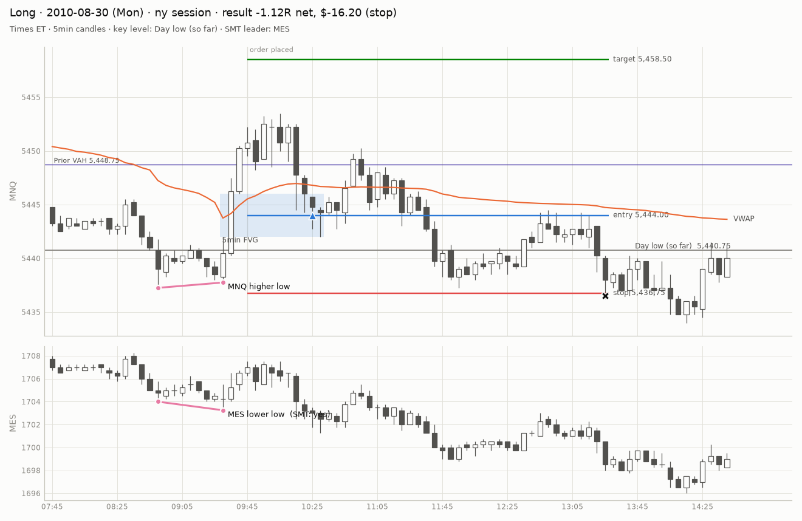
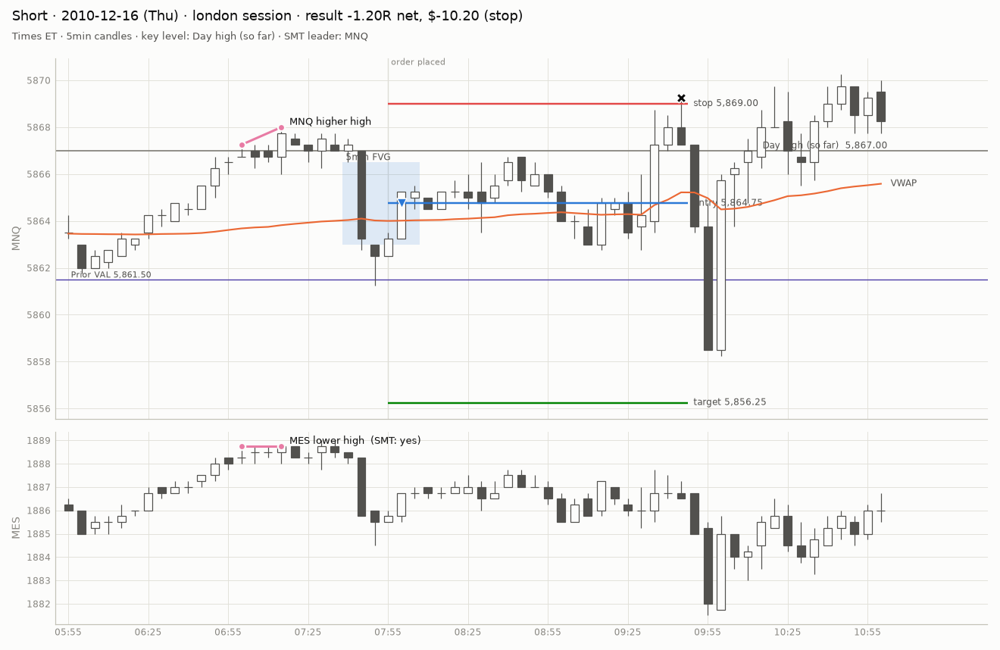
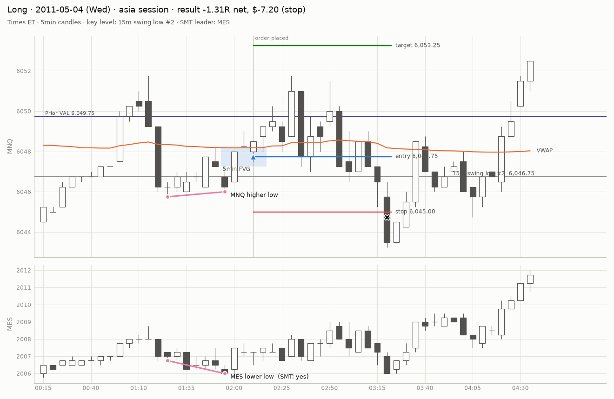
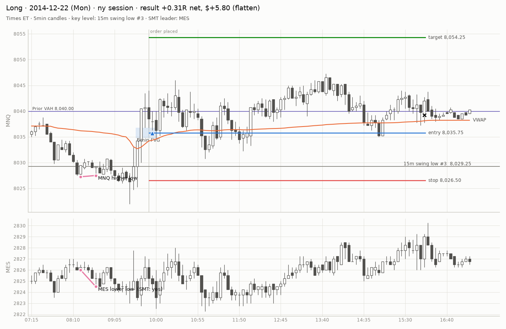
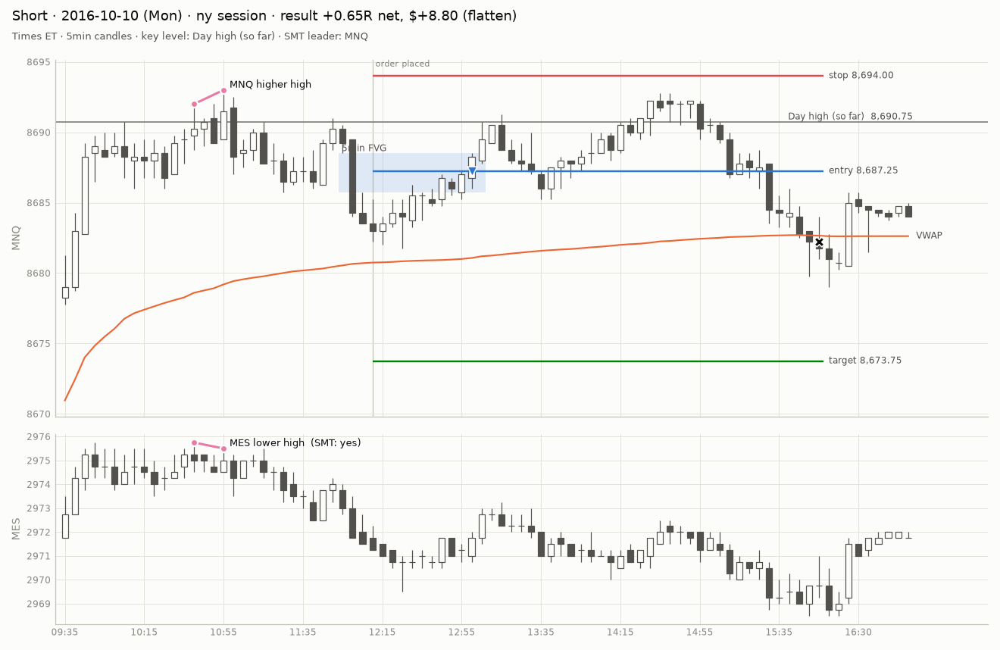
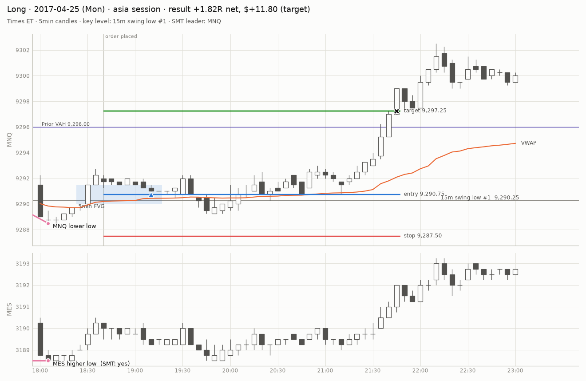
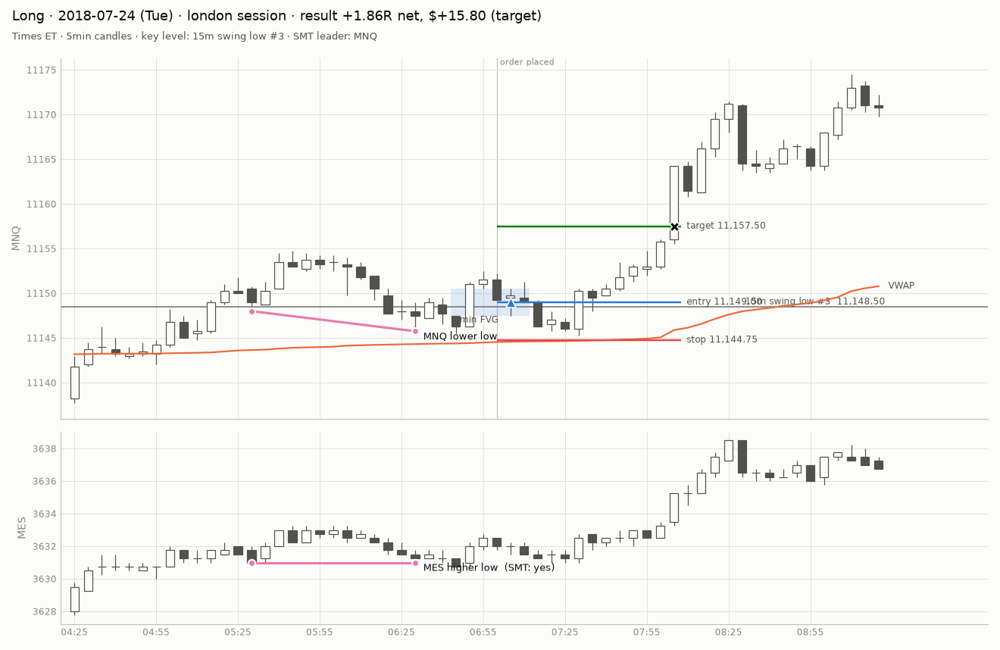
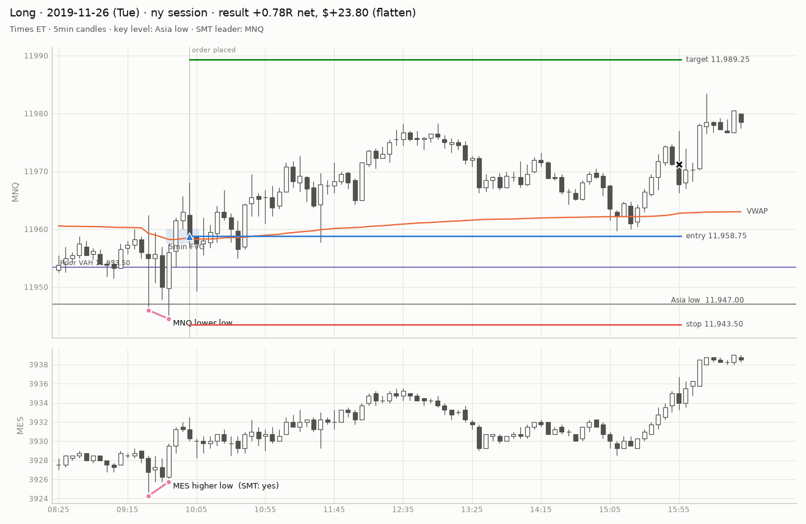
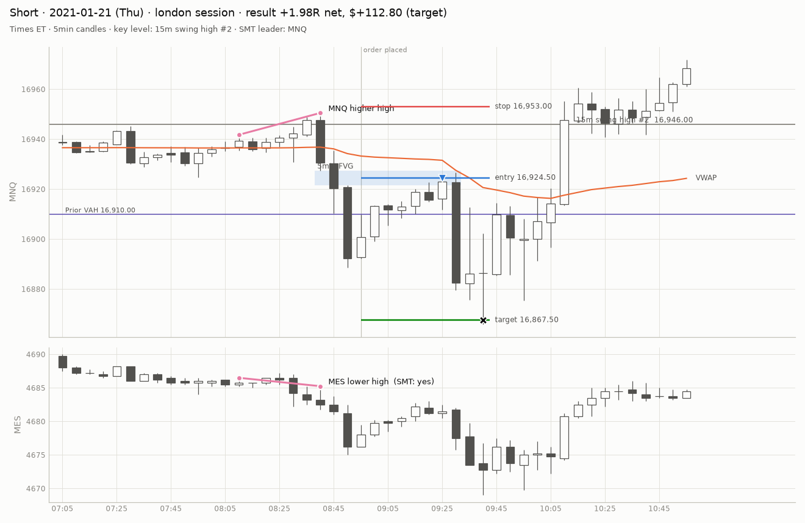

# Example signals — `baseline` (real, dev)

Randomly sampled trades (winners, losers and time exits). Check each against how you would mark it by hand.

## Example 1

- placed 2010-08-30 09:45 ET, filled 10:25, exit 13:28 (stop)
- entry 5444.00, stop 5436.75, target 5458.50, risk 7.25 pts, result -1.12R net ($-16.20)
- key level `dl`, SMT leader MES, vol regime normal, VWAP side below, value area inside, structure against

## Example 2

- placed 2010-12-16 07:55 ET, filled 08:02, exit 09:46 (stop)
- entry 5864.75, stop 5869.00, target 5856.25, risk 4.25 pts, result -1.20R net ($-10.20)
- key level `dh`, SMT leader MNQ, vol regime calm, VWAP side above, value area inside, structure with

## Example 3

- placed 2011-05-04 02:10 ET, filled 02:11, exit 03:23 (stop)
- entry 6047.75, stop 6045.00, target 6053.25, risk 2.75 pts, result -1.31R net ($-7.20)
- key level `sl2`, SMT leader MES, vol regime calm, VWAP side below, value area below_val, structure against

## Example 4

- placed 2014-12-22 09:50 ET, filled 09:56, exit 15:55 (flatten)
- entry 8035.75, stop 8026.50, target 8054.25, risk 9.25 pts, result +0.31R net ($+5.80)
- key level `sl3`, SMT leader MES, vol regime volatile, VWAP side above, value area inside, structure with

## Example 5

- placed 2016-10-10 12:10 ET, filled 13:02, exit 15:55 (flatten)
- entry 8687.25, stop 8694.00, target 8673.75, risk 6.75 pts, result +0.65R net ($+8.80)
- key level `dh`, SMT leader MNQ, vol regime calm, VWAP side above, value area above_vah, structure against

## Example 6

- placed 2017-04-24 18:40 ET, filled 19:12, exit 21:46 (target)
- entry 9290.75, stop 9287.50, target 9297.25, risk 3.25 pts, result +1.82R net ($+11.80)
- key level `sl1`, SMT leader MNQ, vol regime normal, VWAP side above, value area inside, structure with

## Example 7

- placed 2018-07-24 07:00 ET, filled 07:05, exit 08:05 (target)
- entry 11149.00, stop 11144.75, target 11157.50, risk 4.25 pts, result +1.86R net ($+15.80)
- key level `sl3`, SMT leader MNQ, vol regime normal, VWAP side above, value area above_vah, structure with

## Example 8

- placed 2019-11-26 10:00 ET, filled 10:02, exit 15:55 (flatten)
- entry 11958.75, stop 11943.50, target 11989.25, risk 15.25 pts, result +0.78R net ($+23.80)
- key level `asia_l`, SMT leader MNQ, vol regime normal, VWAP side above, value area above_vah, structure with

## Example 9

- placed 2021-01-21 08:55 ET, filled 09:29, exit 09:42 (target)
- entry 16924.50, stop 16953.00, target 16867.50, risk 28.50 pts, result +1.98R net ($+112.80)
- key level `sh2`, SMT leader MNQ, vol regime normal, VWAP side below, value area above_vah, structure against
