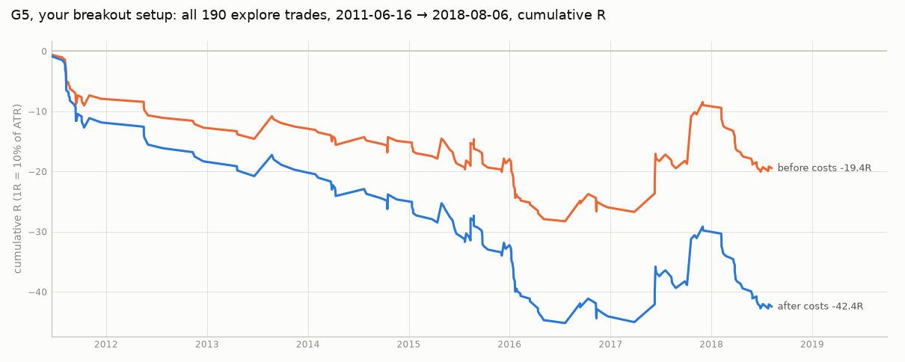

# G5 example trades (explore split only)

Your breakout setup as pre-registered in [GAMMA.md](../../../../GAMMA.md), on MNQ explore data (NQ prices, back-adjusted, before MNQ existed). Validate and final-test dates are not loaded.

Chosen by rule, not by eye: for each gamma regime the best trade, the worst trade and 2 random trades (seed 0). Of all 190 trades, 29 made money after costs.

| chart | picked as | gamma | date | side | FVG | exit | R net |
|---|---|---|---|---|---|---|---:|
| [g5_01.png](g5_01.png) | best | positive | 2017-10-19 | short | 15min | target | +7.68 |
| [g5_02.png](g5_02.png) | worst | positive | 2016-11-09 | long | 5min | stop | -2.08 |
| [g5_03.png](g5_03.png) | random | positive | 2016-11-08 | short | 5min | stop | -0.78 |
| [g5_04.png](g5_04.png) | random | positive | 2018-02-05 | short | 5min | stop | -0.53 |
| [g5_05.png](g5_05.png) | best | negative | 2014-10-17 | long | 15min | stop | +2.42 |
| [g5_06.png](g5_06.png) | worst | negative | 2015-08-24 | long | 15min | stop | -1.71 |
| [g5_07.png](g5_07.png) | random | negative | 2011-09-13 | long | 5min | stop | -0.40 |
| [g5_08.png](g5_08.png) | random | negative | 2011-10-05 | long | 5min | stop | -0.29 |

How to read a chart: violet triangles are the two latest 5m swing highs / lows when the FVG started (HH/HL for longs, LH/LL for shorts); the dashed violet line is the key level the FVG's candles broke; the shaded band is the FVG; blue = limit entry (triangle = fill), red = stop (a step line when it trails; a red ring marks the swing that sets a round-2 stop), green = target, orange = VWAP, X = exit.
