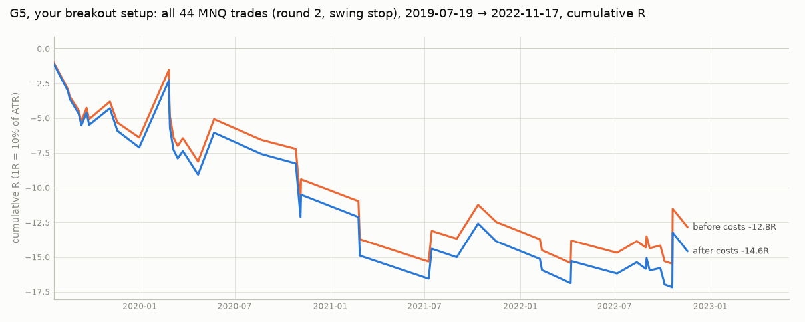

# G5 example trades, round 2 (MNQ, 2019-07-01 → 2022-12-30)

Your breakout setup with the round-2 stop (1% of ATR beyond the latest swing; GAMMA.md, Round 2), on MNQ's own prices (back-adjusted for rolls). Nothing after 2022-12-30 is loaded; the final test stays locked.

Chosen by rule, not by eye: for each gamma regime the best trade, the worst trade and 2 random trades (seed 0). Of all 44 trades, 13 made money after costs.

| chart | picked as | gamma | date | side | FVG | exit | R net |
|---|---|---|---|---|---|---|---:|
| [g5_01.png](g5_01.png) | best | positive | 2020-05-22 | long | 5min | target | +3.02 |
| [g5_02.png](g5_02.png) | worst | positive | 2020-11-04 | long | 5min | stop | -3.84 |
| [g5_03.png](g5_03.png) | random | positive | 2021-07-14 | short | 15min | flatten | +2.15 |
| [g5_04.png](g5_04.png) | random | positive | 2022-02-11 | short | 15min | stop | -0.81 |
| [g5_05.png](g5_05.png) | best | negative | 2020-02-25 | short | 15min | flatten | +4.83 |
| [g5_06.png](g5_06.png) | worst | negative | 2021-02-26 | short | 5min | stop | -2.78 |
| [g5_07.png](g5_07.png) | random | negative | 2020-03-13 | long | 5min | stop | -0.61 |
| [g5_08.png](g5_08.png) | random | negative | 2020-03-23 | long | 15min | stop | +0.54 |

How to read a chart: violet triangles are the two latest 5m swing highs / lows when the FVG started (HH/HL for longs, LH/LL for shorts); the dashed violet line is the key level the FVG's candles broke; the shaded band is the FVG; blue = limit entry (triangle = fill), red = stop (a step line when it trails; a red ring marks the swing that sets a round-2 stop), green = target, orange = VWAP, X = exit.
