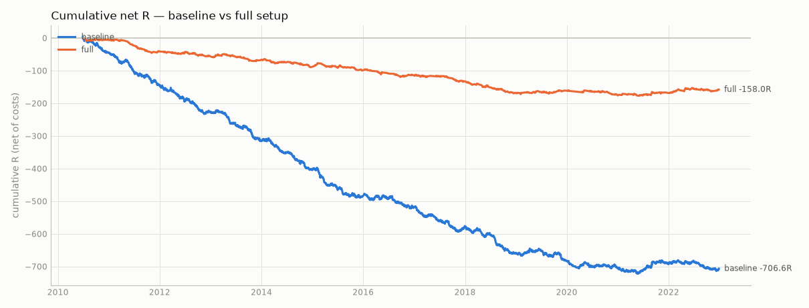
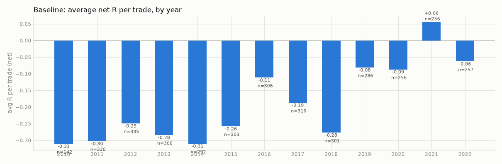

# Step 3 — does each piece help? (real, dev: 2010-06-07 → 2022-12-31)

19 strategy configurations were run (plus 2 engine-sensitivity runs). No parameter was tuned: every variant uses config/default.yaml and changes only the piece named.

- **avg R net**: average result per trade in units of initial risk, after commission, fees and slippage.
- **95% CI**: bootstrap confidence interval of avg R, resampling trades, and resampling whole trading days (safer when trades cluster).
- **PF**: gross profit ÷ gross loss in dollars, after costs. **max DD**: largest peak-to-trough fall of closed-trade equity.
- Rows marked ⚠ have fewer than 100 trades: treat them as anecdotes.

| variant | trades | /yr | win % | avg R net | 95% CI (trades) | 95% CI (day blocks) | PF | net $ | max DD $ | max DD R | longest losing streak | same-bar ambiguous | note |
|---|---|---|---|---|---|---|---|---|---|---|---|---|---|
| baseline | 3686 | 295 | 33.2 | -0.192 | [-0.235, -0.149] | [-0.235, -0.147] | 0.86 | -8,439 | 8,924 | 723.3 | 21 | 0.1% |  |
| +mood | 1618 | 130 | 35.2 | -0.139 | [-0.203, -0.072] | [-0.204, -0.073] | 0.91 | -2,528 | 4,651 | 249.0 | 13 | 0.0% |  |
| +structure | 1779 | 142 | 33.3 | -0.183 | [-0.246, -0.120] | [-0.245, -0.120] | 0.94 | -1,957 | 5,931 | 370.1 | 16 | 0.0% |  |
| +vwap | 2210 | 177 | 33.6 | -0.183 | [-0.238, -0.128] | [-0.239, -0.125] | 0.87 | -5,144 | 6,135 | 410.8 | 18 | 0.0% |  |
| +value_area | 3758 | 301 | 33.1 | -0.194 | [-0.237, -0.152] | [-0.239, -0.150] | 0.85 | -9,259 | 9,612 | 740.9 | 21 | 0.1% |  |
| +fvg_15m | 1660 | 133 | 35.5 | -0.147 | [-0.209, -0.083] | [-0.211, -0.082] | 0.92 | -2,429 | 3,151 | 248.9 | 16 | 0.1% |  |
| +liquidity_target | 3592 | 287 | 34.9 | -0.176 | [-0.223, -0.130] | [-0.224, -0.130] | 0.87 | -7,521 | 8,178 | 647.9 | 21 | 0.0% |  |
| confirm smt only | 3054 | 244 | 33.1 | -0.195 | [-0.243, -0.147] | [-0.244, -0.146] | 0.83 | -8,329 | 8,628 | 602.7 | 23 | 0.1% |  |
| confirm trend only | 982 | 79 | 33.6 | -0.180 | [-0.262, -0.097] | [-0.262, -0.098] | 0.99 | -185 | 3,349 | 208.2 | 18 | 0.0% |  |
| confirm none | 8821 | 705 | 33.3 | -0.177 | [-0.205, -0.149] | [-0.205, -0.149] | 0.90 | -14,352 | 16,696 | 1582.1 | 20 | 0.0% |  |
| confirm swing smt only | 1382 | 111 | 33.4 | -0.188 | [-0.259, -0.116] | [-0.258, -0.114] | 0.88 | -2,399 | 2,860 | 274.1 | 14 | 0.0% |  |
| full | 870 | 70 | 33.8 | -0.182 | [-0.266, -0.096] | [-0.267, -0.096] | 0.94 | -1,073 | 3,484 | 177.0 | 14 | 0.0% |  |
| full −key_level | 4272 | 342 | 33.4 | -0.168 | [-0.208, -0.127] | [-0.207, -0.128] | 0.89 | -10,181 | 12,683 | 742.6 | 18 | 0.0% |  |
| full −confirm | 870 | 70 | 33.8 | -0.182 | [-0.266, -0.096] | [-0.267, -0.096] | 0.94 | -1,073 | 3,484 | 177.0 | 14 | 0.0% |  |
| full −fvg | 1789 | 143 | 32.6 | -0.199 | [-0.262, -0.135] | [-0.261, -0.137] | 0.98 | -615 | 4,011 | 377.0 | 14 | 0.0% |  |
| full −mood | 1330 | 107 | 32.7 | -0.205 | [-0.275, -0.137] | [-0.275, -0.133] | 0.91 | -2,151 | 5,077 | 294.1 | 14 | 0.0% |  |
| full −structure | 1307 | 105 | 34.9 | -0.153 | [-0.226, -0.079] | [-0.226, -0.077] | 0.91 | -2,070 | 3,670 | 216.2 | 11 | 0.0% |  |
| full −vwap | 986 | 79 | 33.8 | -0.183 | [-0.266, -0.102] | [-0.264, -0.101] | 0.92 | -1,581 | 4,102 | 202.2 | 11 | 0.0% |  |
| full −value_area | 798 | 64 | 34.1 | -0.170 | [-0.259, -0.074] | [-0.262, -0.078] | 0.98 | -355 | 3,144 | 161.9 | 18 | 0.0% |  |
| baseline, touch fills | 3843 | 307 | 34.9 | -0.142 | [-0.183, -0.098] | [-0.185, -0.100] | 0.89 | -6,942 | 7,414 | 562.4 | 21 | 0.1% |  |
| baseline, target first | 3686 | 295 | 33.2 | -0.190 | [-0.233, -0.147] | [-0.234, -0.145] | 0.86 | -8,374 | 8,858 | 717.2 | 21 | 0.1% |  |

### Comparison to reference (difference in avg R net, ± ~2 standard errors)

Overlapping trade sets make this rough; 'better/worse' needs the gap to exceed about two standard errors.

- **+mood**: +0.053R vs baseline (±0.081) → no clear difference
- **+structure**: +0.009R vs baseline (±0.077) → no clear difference
- **+vwap**: +0.009R vs baseline (±0.072) → no clear difference
- **+value_area**: -0.003R vs baseline (±0.062) → no clear difference
- **+fvg_15m**: +0.045R vs baseline (±0.078) → no clear difference
- **+liquidity_target**: +0.015R vs baseline (±0.065) → no clear difference
- **confirm smt only**: -0.004R vs baseline (±0.066) → no clear difference
- **confirm trend only**: +0.012R vs baseline (±0.096) → no clear difference
- **confirm none**: +0.015R vs baseline (±0.053) → no clear difference
- **confirm swing smt only**: +0.004R vs baseline (±0.085) → no clear difference
- **full**: +0.010R vs baseline (±0.100) → no clear difference
- **full −key_level**: +0.014R vs full (±0.099) → no clear difference
- **full −confirm**: +0.000R vs full (±0.127) → no clear difference
- **full −fvg**: -0.018R vs full (±0.111) → no clear difference
- **full −mood**: -0.023R vs full (±0.115) → no clear difference
- **full −structure**: +0.029R vs full (±0.116) → no clear difference
- **full −vwap**: -0.002R vs full (±0.123) → no clear difference
- **full −value_area**: +0.012R vs full (±0.130) → no clear difference
- **baseline, touch fills**: +0.049R vs baseline (±0.063) → no clear difference
- **baseline, target first**: +0.002R vs baseline (±0.063) → no clear difference

## baseline

Signal funnel (how many candidates each rule removed)

| step | count |
|---|---:|
| triggers (all MNQ swings) | 307,682 |
| at a key level | 107,990 |
| with an FVG entry | 43,263 |
| risk within limits | 38,561 |
| placed inside trading hours | 38,459 |
| tradeable day (not short/gap/spike) | 36,974 |
| allowed session | 36,051 |
| outside no-entry windows | 35,191 |
| before flatten time | 35,191 |
| ATR available | 35,191 |
| confirmed: smt or trend | 11,483 |
| in period | 9,382 |
| order: filled | 3,686 |
| order: skipped_busy | 3,208 |
| order: expired_timeout | 1,263 |
| order: cancel_target_first | 1,225 |

**By session**

| session | trades | win_rate | avg_r_net | net_pnl_usd | profit_factor |
|---|---|---|---|---|---|
| asia | 898 | 32.5% | -0.190 | -1,152 | 0.91 |
| london | 1,244 | 30.6% | -0.224 | -3,774 | 0.80 |
| ny | 1,544 | 35.6% | -0.167 | -3,513 | 0.89 |

**By weekday**

| weekday | trades | win_rate | avg_r_net | net_pnl_usd | profit_factor |
|---|---|---|---|---|---|
| Monday | 633 | 36.0% | -0.131 | -672 | 0.93 |
| Tuesday | 792 | 33.5% | -0.180 | -1,699 | 0.87 |
| Wednesday | 779 | 33.0% | -0.192 | -1,067 | 0.92 |
| Thursday | 684 | 30.8% | -0.262 | -2,336 | 0.82 |
| Friday | 798 | 32.8% | -0.191 | -2,665 | 0.81 |

**By year**

| year | trades | win_rate | avg_r_net | net_pnl_usd | profit_factor |
|---|---|---|---|---|---|
| 2010 | 142 | 32.4% | -0.311 | -478 | 0.55 |
| 2011 | 330 | 30.6% | -0.303 | -848 | 0.71 |
| 2012 | 335 | 34.3% | -0.249 | -760 | 0.71 |
| 2013 | 306 | 32.0% | -0.284 | -772 | 0.66 |
| 2014 | 292 | 31.5% | -0.310 | -737 | 0.72 |
| 2015 | 303 | 31.0% | -0.258 | -1,101 | 0.69 |
| 2016 | 306 | 35.6% | -0.111 | -429 | 0.86 |
| 2017 | 316 | 34.8% | -0.187 | -703 | 0.76 |
| 2018 | 301 | 28.2% | -0.277 | -2,077 | 0.65 |
| 2019 | 286 | 36.4% | -0.081 | 382 | 1.10 |
| 2020 | 256 | 32.8% | -0.087 | -174 | 0.98 |
| 2021 | 256 | 38.7% | +0.056 | -702 | 0.91 |
| 2022 | 257 | 33.5% | -0.063 | -41 | 1.00 |

**By direction**

| direction | trades | win_rate | avg_r_net | net_pnl_usd | profit_factor |
|---|---|---|---|---|---|
| long | 1,821 | 35.5% | -0.138 | -4,107 | 0.87 |
| short | 1,865 | 30.9% | -0.244 | -4,332 | 0.86 |

**By vol regime**

| vol regime | trades | win_rate | avg_r_net | net_pnl_usd | profit_factor |
|---|---|---|---|---|---|
|  | 7 | 28.6% | -0.274 | -20 | 0.60 |
| calm | 714 | 33.5% | -0.191 | 485 | 1.05 |
| normal | 2,519 | 32.9% | -0.205 | -7,870 | 0.82 |
| volatile | 446 | 34.3% | -0.119 | -1,033 | 0.90 |

**By key level**

| key level | trades | win_rate | avg_r_net | net_pnl_usd | profit_factor |
|---|---|---|---|---|---|
| asia_h | 560 | 29.8% | -0.287 | -1,340 | 0.84 |
| asia_l | 520 | 35.8% | -0.147 | -2,870 | 0.66 |
| dh | 25 | 16.0% | -0.707 | -395 | 0.37 |
| dl | 32 | 31.2% | -0.159 | -148 | 0.79 |
| london_h | 424 | 33.7% | -0.188 | -742 | 0.88 |
| london_l | 438 | 36.3% | -0.139 | -1,348 | 0.84 |
| ny_h | 222 | 30.2% | -0.242 | -812 | 0.78 |
| ny_l | 176 | 41.5% | +0.039 | 59 | 1.02 |
| pdh | 405 | 27.7% | -0.319 | -1,789 | 0.72 |
| pdl | 330 | 35.2% | -0.121 | 481 | 1.08 |
| sh1 | 79 | 32.9% | -0.160 | 722 | 1.54 |
| sh2 | 78 | 35.9% | -0.085 | -122 | 0.94 |
| sh3 | 72 | 40.3% | +0.082 | 145 | 1.07 |
| sl1 | 115 | 32.2% | -0.231 | -771 | 0.60 |
| sl2 | 108 | 32.4% | -0.227 | 1,044 | 1.54 |
| sl3 | 102 | 30.4% | -0.251 | -554 | 0.66 |

**By confirmation**

| confirmation | trades | win_rate | avg_r_net | net_pnl_usd | profit_factor |
|---|---|---|---|---|---|
| smt | 2,761 | 33.0% | -0.196 | -8,202 | 0.82 |
| smt+trend | 194 | 37.1% | -0.125 | 68 | 1.02 |
| trend | 731 | 32.7% | -0.195 | -305 | 0.98 |

**By SMT leader**

| SMT leader | trades | win_rate | avg_r_net | net_pnl_usd | profit_factor |
|---|---|---|---|---|---|
|  | 731 | 32.7% | -0.195 | -305 | 0.98 |
| MES | 1,417 | 34.5% | -0.146 | -3,329 | 0.86 |
| MNQ | 1,538 | 32.2% | -0.232 | -4,805 | 0.80 |

**By VWAP side**

| VWAP side | trades | win_rate | avg_r_net | net_pnl_usd | profit_factor |
|---|---|---|---|---|---|
| above | 1,963 | 33.1% | -0.208 | -5,396 | 0.83 |
| below | 1,723 | 33.3% | -0.173 | -3,044 | 0.90 |

**By value area**

| value area | trades | win_rate | avg_r_net | net_pnl_usd | profit_factor |
|---|---|---|---|---|---|
|  | 2 | 50.0% | +0.308 | 3 | 1.32 |
| above_vah | 1,132 | 32.0% | -0.243 | -3,103 | 0.83 |
| below_val | 876 | 35.7% | -0.097 | 1,762 | 1.11 |
| inside | 1,676 | 32.6% | -0.207 | -7,101 | 0.74 |

**By structure**

| structure | trades | win_rate | avg_r_net | net_pnl_usd | profit_factor |
|---|---|---|---|---|---|
| against | 2,035 | 32.8% | -0.204 | -6,860 | 0.79 |
| with | 1,651 | 33.7% | -0.177 | -1,579 | 0.95 |

**By news day**

| news day | trades | win_rate | avg_r_net | net_pnl_usd | profit_factor |
|---|---|---|---|---|---|
| False | 3,392 | 33.3% | -0.190 | -6,486 | 0.88 |
| True | 294 | 31.3% | -0.214 | -1,953 | 0.68 |

**By target**

| target | trades | win_rate | avg_r_net | net_pnl_usd | profit_factor |
|---|---|---|---|---|---|
| r_multiple | 3,686 | 33.2% | -0.192 | -8,439 | 0.86 |

## +mood

Overrides: `{"setup.filters.mood": true}`

Signal funnel (how many candidates each rule removed)

| step | count |
|---|---:|
| triggers (all MNQ swings) | 307,682 |
| at a key level | 107,990 |
| with an FVG entry | 43,263 |
| risk within limits | 38,561 |
| placed inside trading hours | 38,459 |
| tradeable day (not short/gap/spike) | 36,974 |
| allowed session | 36,051 |
| outside no-entry windows | 35,191 |
| before flatten time | 35,191 |
| ATR available | 35,191 |
| confirmed: smt or trend | 11,483 |
| filter: mood | 4,750 |
| in period | 3,831 |
| order: filled | 1,618 |
| order: skipped_busy | 1,053 |
| order: expired_timeout | 622 |
| order: cancel_target_first | 538 |

**By session**

| session | trades | win_rate | avg_r_net | net_pnl_usd | profit_factor |
|---|---|---|---|---|---|
| asia | 421 | 33.0% | -0.162 | -447 | 0.93 |
| london | 556 | 31.8% | -0.181 | -1,895 | 0.79 |
| ny | 641 | 39.6% | -0.087 | -187 | 0.99 |

**By weekday**

| weekday | trades | win_rate | avg_r_net | net_pnl_usd | profit_factor |
|---|---|---|---|---|---|
| Monday | 283 | 38.2% | -0.085 | -853 | 0.81 |
| Tuesday | 341 | 35.2% | -0.135 | -790 | 0.87 |
| Wednesday | 350 | 31.4% | -0.246 | -1,722 | 0.75 |
| Thursday | 307 | 38.1% | -0.025 | 2,159 | 1.41 |
| Friday | 337 | 34.1% | -0.180 | -1,322 | 0.80 |

**By year**

| year | trades | win_rate | avg_r_net | net_pnl_usd | profit_factor |
|---|---|---|---|---|---|
| 2010 | 56 | 32.1% | -0.366 | -215 | 0.51 |
| 2011 | 162 | 30.9% | -0.297 | -467 | 0.70 |
| 2012 | 155 | 36.1% | -0.193 | -352 | 0.72 |
| 2013 | 138 | 40.6% | -0.068 | -111 | 0.89 |
| 2014 | 119 | 33.6% | -0.297 | -355 | 0.67 |
| 2015 | 125 | 38.4% | -0.037 | -184 | 0.87 |
| 2016 | 112 | 36.6% | -0.059 | 86 | 1.07 |
| 2017 | 130 | 38.5% | -0.130 | -309 | 0.76 |
| 2018 | 150 | 28.7% | -0.240 | -990 | 0.65 |
| 2019 | 108 | 33.3% | -0.135 | -148 | 0.91 |
| 2020 | 119 | 28.6% | -0.219 | -1,026 | 0.76 |
| 2021 | 115 | 41.7% | +0.142 | -287 | 0.93 |
| 2022 | 129 | 38.8% | +0.057 | 1,829 | 1.25 |

## +structure

Overrides: `{"setup.filters.structure": true}`

Signal funnel (how many candidates each rule removed)

| step | count |
|---|---:|
| triggers (all MNQ swings) | 307,682 |
| at a key level | 107,990 |
| with an FVG entry | 43,263 |
| risk within limits | 38,561 |
| placed inside trading hours | 38,459 |
| tradeable day (not short/gap/spike) | 36,974 |
| allowed session | 36,051 |
| outside no-entry windows | 35,191 |
| before flatten time | 35,191 |
| ATR available | 35,191 |
| confirmed: smt or trend | 11,483 |
| filter: structure | 5,128 |
| in period | 4,163 |
| order: filled | 1,779 |
| order: skipped_busy | 1,162 |
| order: expired_timeout | 662 |
| order: cancel_target_first | 553 |
| order: expired_structure_flip | 7 |

**By session**

| session | trades | win_rate | avg_r_net | net_pnl_usd | profit_factor |
|---|---|---|---|---|---|
| asia | 399 | 31.6% | -0.211 | -375 | 0.93 |
| london | 558 | 29.6% | -0.237 | -1,624 | 0.82 |
| ny | 822 | 36.7% | -0.133 | 42 | 1.00 |

**By weekday**

| weekday | trades | win_rate | avg_r_net | net_pnl_usd | profit_factor |
|---|---|---|---|---|---|
| Monday | 306 | 37.6% | -0.093 | -367 | 0.92 |
| Tuesday | 398 | 34.7% | -0.142 | -361 | 0.94 |
| Wednesday | 364 | 35.7% | -0.097 | 877 | 1.15 |
| Thursday | 333 | 30.3% | -0.270 | -6 | 1.00 |
| Friday | 378 | 28.8% | -0.305 | -2,101 | 0.72 |

**By year**

| year | trades | win_rate | avg_r_net | net_pnl_usd | profit_factor |
|---|---|---|---|---|---|
| 2010 | 67 | 32.8% | -0.289 | -268 | 0.51 |
| 2011 | 164 | 27.4% | -0.361 | -649 | 0.58 |
| 2012 | 174 | 33.3% | -0.246 | -443 | 0.69 |
| 2013 | 150 | 30.0% | -0.336 | -504 | 0.59 |
| 2014 | 147 | 35.4% | -0.198 | -271 | 0.80 |
| 2015 | 150 | 34.0% | -0.170 | -344 | 0.80 |
| 2016 | 131 | 29.8% | -0.282 | -370 | 0.76 |
| 2017 | 160 | 35.0% | -0.212 | -416 | 0.72 |
| 2018 | 155 | 26.5% | -0.312 | -1,556 | 0.55 |
| 2019 | 125 | 40.0% | +0.058 | 305 | 1.16 |
| 2020 | 121 | 31.4% | -0.146 | -791 | 0.84 |
| 2021 | 113 | 41.6% | +0.130 | 777 | 1.23 |
| 2022 | 122 | 40.2% | +0.134 | 2,575 | 1.40 |

## +vwap

Overrides: `{"setup.filters.vwap": true}`

Signal funnel (how many candidates each rule removed)

| step | count |
|---|---:|
| triggers (all MNQ swings) | 307,682 |
| at a key level | 107,990 |
| with an FVG entry | 43,263 |
| risk within limits | 38,561 |
| placed inside trading hours | 38,459 |
| tradeable day (not short/gap/spike) | 36,974 |
| allowed session | 36,051 |
| outside no-entry windows | 35,191 |
| before flatten time | 35,191 |
| ATR available | 35,191 |
| confirmed: smt or trend | 11,483 |
| filter: vwap | 6,456 |
| in period | 5,270 |
| order: filled | 2,210 |
| order: skipped_busy | 1,528 |
| order: expired_timeout | 912 |
| order: cancel_target_first | 620 |

**By session**

| session | trades | win_rate | avg_r_net | net_pnl_usd | profit_factor |
|---|---|---|---|---|---|
| asia | 625 | 33.8% | -0.140 | -772 | 0.91 |
| london | 649 | 29.4% | -0.248 | -2,141 | 0.79 |
| ny | 936 | 36.4% | -0.166 | -2,231 | 0.89 |

**By weekday**

| weekday | trades | win_rate | avg_r_net | net_pnl_usd | profit_factor |
|---|---|---|---|---|---|
| Monday | 397 | 36.5% | -0.120 | -562 | 0.91 |
| Tuesday | 479 | 35.1% | -0.143 | -1,039 | 0.87 |
| Wednesday | 473 | 30.4% | -0.268 | -1,316 | 0.84 |
| Thursday | 387 | 33.1% | -0.198 | 154 | 1.02 |
| Friday | 474 | 33.3% | -0.177 | -2,380 | 0.75 |

**By year**

| year | trades | win_rate | avg_r_net | net_pnl_usd | profit_factor |
|---|---|---|---|---|---|
| 2010 | 82 | 36.6% | -0.161 | -206 | 0.66 |
| 2011 | 205 | 30.2% | -0.300 | -602 | 0.69 |
| 2012 | 211 | 35.5% | -0.225 | -530 | 0.70 |
| 2013 | 189 | 35.4% | -0.177 | -404 | 0.73 |
| 2014 | 176 | 29.0% | -0.377 | -723 | 0.58 |
| 2015 | 191 | 32.5% | -0.218 | -577 | 0.74 |
| 2016 | 180 | 35.0% | -0.143 | -260 | 0.87 |
| 2017 | 199 | 34.2% | -0.233 | -655 | 0.68 |
| 2018 | 178 | 24.7% | -0.363 | -1,842 | 0.52 |
| 2019 | 157 | 40.8% | +0.035 | 499 | 1.22 |
| 2020 | 154 | 35.1% | -0.023 | 491 | 1.09 |
| 2021 | 128 | 36.7% | +0.001 | -672 | 0.84 |
| 2022 | 160 | 35.0% | -0.034 | 338 | 1.04 |

## +value_area

Overrides: `{"setup.filters.value_area": true}`

Signal funnel (how many candidates each rule removed)

| step | count |
|---|---:|
| triggers (all MNQ swings) | 307,682 |
| at a key level | 112,906 |
| with an FVG entry | 45,400 |
| risk within limits | 40,456 |
| placed inside trading hours | 40,345 |
| tradeable day (not short/gap/spike) | 38,798 |
| allowed session | 37,827 |
| outside no-entry windows | 36,922 |
| before flatten time | 36,922 |
| ATR available | 36,922 |
| confirmed: smt or trend | 11,757 |
| in period | 9,606 |
| order: filled | 3,758 |
| order: skipped_busy | 3,310 |
| order: expired_timeout | 1,289 |
| order: cancel_target_first | 1,249 |

**By session**

| session | trades | win_rate | avg_r_net | net_pnl_usd | profit_factor |
|---|---|---|---|---|---|
| asia | 918 | 32.0% | -0.204 | -1,535 | 0.88 |
| london | 1,266 | 30.6% | -0.223 | -3,884 | 0.79 |
| ny | 1,574 | 35.8% | -0.166 | -3,841 | 0.88 |

**By weekday**

| weekday | trades | win_rate | avg_r_net | net_pnl_usd | profit_factor |
|---|---|---|---|---|---|
| Monday | 647 | 36.0% | -0.138 | -782 | 0.92 |
| Tuesday | 810 | 33.2% | -0.187 | -2,031 | 0.85 |
| Wednesday | 795 | 32.8% | -0.199 | -1,349 | 0.90 |
| Thursday | 697 | 30.8% | -0.262 | -2,286 | 0.83 |
| Friday | 809 | 33.0% | -0.184 | -2,810 | 0.81 |

**By year**

| year | trades | win_rate | avg_r_net | net_pnl_usd | profit_factor |
|---|---|---|---|---|---|
| 2010 | 145 | 33.1% | -0.299 | -460 | 0.57 |
| 2011 | 334 | 30.5% | -0.307 | -860 | 0.71 |
| 2012 | 339 | 34.8% | -0.237 | -722 | 0.73 |
| 2013 | 309 | 32.0% | -0.283 | -775 | 0.67 |
| 2014 | 300 | 31.3% | -0.318 | -772 | 0.71 |
| 2015 | 309 | 31.1% | -0.261 | -1,090 | 0.70 |
| 2016 | 315 | 35.9% | -0.105 | -408 | 0.87 |
| 2017 | 320 | 34.7% | -0.194 | -746 | 0.75 |
| 2018 | 308 | 27.6% | -0.292 | -2,308 | 0.62 |
| 2019 | 294 | 36.7% | -0.071 | 377 | 1.09 |
| 2020 | 261 | 32.6% | -0.093 | -286 | 0.97 |
| 2021 | 263 | 38.0% | +0.037 | -825 | 0.90 |
| 2022 | 261 | 33.0% | -0.078 | -382 | 0.97 |

## +fvg_15m

Overrides: `{"rules.fvg.timeframe": "15min"}`

Signal funnel (how many candidates each rule removed)

| step | count |
|---|---:|
| triggers (all MNQ swings) | 307,682 |
| at a key level | 107,990 |
| with an FVG entry | 17,086 |
| risk within limits | 16,819 |
| placed inside trading hours | 16,761 |
| tradeable day (not short/gap/spike) | 16,082 |
| allowed session | 15,548 |
| outside no-entry windows | 15,224 |
| before flatten time | 15,224 |
| ATR available | 15,224 |
| confirmed: smt or trend | 5,771 |
| in period | 4,641 |
| order: filled | 1,660 |
| order: expired_timeout | 1,244 |
| order: skipped_busy | 1,025 |
| order: cancel_target_first | 712 |

**By session**

| session | trades | win_rate | avg_r_net | net_pnl_usd | profit_factor |
|---|---|---|---|---|---|
| asia | 372 | 27.7% | -0.320 | -1,745 | 0.74 |
| london | 551 | 31.4% | -0.186 | -1,507 | 0.83 |
| ny | 737 | 42.6% | -0.029 | 823 | 1.06 |

**By weekday**

| weekday | trades | win_rate | avg_r_net | net_pnl_usd | profit_factor |
|---|---|---|---|---|---|
| Monday | 319 | 34.5% | -0.196 | -714 | 0.88 |
| Tuesday | 354 | 33.6% | -0.186 | -1,978 | 0.68 |
| Wednesday | 307 | 36.5% | -0.118 | 720 | 1.13 |
| Thursday | 340 | 36.2% | -0.125 | -1,001 | 0.86 |
| Friday | 340 | 37.1% | -0.106 | 545 | 1.10 |

**By year**

| year | trades | win_rate | avg_r_net | net_pnl_usd | profit_factor |
|---|---|---|---|---|---|
| 2010 | 81 | 30.9% | -0.327 | -224 | 0.63 |
| 2011 | 148 | 35.8% | -0.137 | -185 | 0.87 |
| 2012 | 139 | 31.7% | -0.336 | -568 | 0.56 |
| 2013 | 168 | 29.8% | -0.333 | -557 | 0.60 |
| 2014 | 141 | 38.3% | -0.127 | 3 | 1.00 |
| 2015 | 154 | 38.3% | -0.061 | -263 | 0.85 |
| 2016 | 127 | 40.2% | +0.022 | 26 | 1.02 |
| 2017 | 134 | 30.6% | -0.331 | -679 | 0.54 |
| 2018 | 120 | 33.3% | -0.129 | -551 | 0.78 |
| 2019 | 125 | 44.0% | +0.104 | 616 | 1.37 |
| 2020 | 97 | 36.1% | -0.087 | 103 | 1.02 |
| 2021 | 108 | 39.8% | -0.021 | -271 | 0.93 |
| 2022 | 118 | 33.9% | -0.100 | 121 | 1.02 |

## +liquidity_target

Overrides: `{"setup.target.mode": "liquidity"}`

Signal funnel (how many candidates each rule removed)

| step | count |
|---|---:|
| triggers (all MNQ swings) | 307,682 |
| at a key level | 107,990 |
| with an FVG entry | 43,263 |
| risk within limits | 38,561 |
| placed inside trading hours | 38,459 |
| tradeable day (not short/gap/spike) | 36,974 |
| allowed session | 36,051 |
| outside no-entry windows | 35,191 |
| before flatten time | 35,191 |
| ATR available | 35,191 |
| confirmed: smt or trend | 11,483 |
| in period | 9,382 |
| order: filled | 3,592 |
| order: skipped_busy | 3,069 |
| order: cancel_target_first | 1,528 |
| order: expired_timeout | 1,193 |

**By session**

| session | trades | win_rate | avg_r_net | net_pnl_usd | profit_factor |
|---|---|---|---|---|---|
| asia | 890 | 33.3% | -0.210 | -1,538 | 0.87 |
| london | 1,212 | 31.8% | -0.211 | -3,644 | 0.79 |
| ny | 1,490 | 38.4% | -0.128 | -2,338 | 0.92 |

**By weekday**

| weekday | trades | win_rate | avg_r_net | net_pnl_usd | profit_factor |
|---|---|---|---|---|---|
| Monday | 628 | 38.1% | -0.098 | -900 | 0.90 |
| Tuesday | 770 | 34.2% | -0.197 | -1,486 | 0.88 |
| Wednesday | 762 | 35.0% | -0.181 | -256 | 0.98 |
| Thursday | 665 | 33.5% | -0.221 | -1,718 | 0.86 |
| Friday | 767 | 34.2% | -0.176 | -3,161 | 0.76 |

**By year**

| year | trades | win_rate | avg_r_net | net_pnl_usd | profit_factor |
|---|---|---|---|---|---|
| 2010 | 134 | 41.8% | -0.087 | -125 | 0.86 |
| 2011 | 326 | 32.2% | -0.316 | -873 | 0.69 |
| 2012 | 329 | 33.7% | -0.306 | -876 | 0.67 |
| 2013 | 297 | 35.4% | -0.245 | -705 | 0.68 |
| 2014 | 280 | 34.3% | -0.252 | -587 | 0.76 |
| 2015 | 302 | 34.1% | -0.160 | -865 | 0.74 |
| 2016 | 300 | 36.3% | -0.143 | -695 | 0.77 |
| 2017 | 305 | 36.7% | -0.204 | -641 | 0.76 |
| 2018 | 285 | 29.5% | -0.209 | -1,770 | 0.68 |
| 2019 | 291 | 35.4% | -0.136 | 84 | 1.02 |
| 2020 | 243 | 35.4% | -0.067 | 151 | 1.02 |
| 2021 | 245 | 39.6% | +0.038 | -728 | 0.91 |
| 2022 | 255 | 34.1% | -0.059 | 110 | 1.01 |

## confirm smt only

Overrides: `{"setup.confirm": ["smt"]}`

Signal funnel (how many candidates each rule removed)

| step | count |
|---|---:|
| triggers (all MNQ swings) | 307,682 |
| at a key level | 107,990 |
| with an FVG entry | 43,263 |
| risk within limits | 38,561 |
| placed inside trading hours | 38,459 |
| tradeable day (not short/gap/spike) | 36,974 |
| allowed session | 36,051 |
| outside no-entry windows | 35,191 |
| before flatten time | 35,191 |
| ATR available | 35,191 |
| confirmed: smt | 9,202 |
| in period | 7,584 |
| order: filled | 3,054 |
| order: skipped_busy | 2,539 |
| order: cancel_target_first | 1,041 |
| order: expired_timeout | 950 |

**By session**

| session | trades | win_rate | avg_r_net | net_pnl_usd | profit_factor |
|---|---|---|---|---|---|
| asia | 695 | 33.1% | -0.181 | -805 | 0.91 |
| london | 1,023 | 30.9% | -0.223 | -3,170 | 0.78 |
| ny | 1,336 | 34.8% | -0.182 | -4,354 | 0.83 |

**By weekday**

| weekday | trades | win_rate | avg_r_net | net_pnl_usd | profit_factor |
|---|---|---|---|---|---|
| Monday | 520 | 37.1% | -0.095 | -42 | 0.99 |
| Tuesday | 645 | 32.6% | -0.205 | -1,668 | 0.83 |
| Wednesday | 660 | 33.8% | -0.179 | -906 | 0.91 |
| Thursday | 558 | 28.9% | -0.319 | -4,261 | 0.61 |
| Friday | 671 | 33.4% | -0.178 | -1,452 | 0.87 |

**By year**

| year | trades | win_rate | avg_r_net | net_pnl_usd | profit_factor |
|---|---|---|---|---|---|
| 2010 | 125 | 32.8% | -0.321 | -374 | 0.57 |
| 2011 | 267 | 31.8% | -0.281 | -509 | 0.77 |
| 2012 | 280 | 36.8% | -0.183 | -372 | 0.82 |
| 2013 | 267 | 31.1% | -0.319 | -749 | 0.62 |
| 2014 | 243 | 31.7% | -0.307 | -634 | 0.70 |
| 2015 | 245 | 29.0% | -0.310 | -1,014 | 0.64 |
| 2016 | 266 | 36.1% | -0.088 | -269 | 0.90 |
| 2017 | 269 | 33.8% | -0.197 | -599 | 0.76 |
| 2018 | 239 | 28.9% | -0.254 | -1,453 | 0.68 |
| 2019 | 238 | 35.7% | -0.112 | 149 | 1.05 |
| 2020 | 208 | 34.1% | -0.043 | 254 | 1.04 |
| 2021 | 210 | 38.1% | +0.030 | -1,118 | 0.84 |
| 2022 | 197 | 29.9% | -0.144 | -1,639 | 0.85 |

## confirm trend only

Overrides: `{"setup.confirm": ["trend"]}`

Signal funnel (how many candidates each rule removed)

| step | count |
|---|---:|
| triggers (all MNQ swings) | 307,682 |
| at a key level | 107,990 |
| with an FVG entry | 43,263 |
| risk within limits | 38,561 |
| placed inside trading hours | 38,459 |
| tradeable day (not short/gap/spike) | 36,974 |
| allowed session | 36,051 |
| outside no-entry windows | 35,191 |
| before flatten time | 35,191 |
| ATR available | 35,191 |
| confirmed: trend | 2,950 |
| in period | 2,346 |
| order: filled | 982 |
| order: skipped_busy | 615 |
| order: expired_timeout | 455 |
| order: cancel_target_first | 294 |

**By session**

| session | trades | win_rate | avg_r_net | net_pnl_usd | profit_factor |
|---|---|---|---|---|---|
| asia | 269 | 31.2% | -0.212 | -525 | 0.87 |
| london | 337 | 28.8% | -0.254 | -1,085 | 0.81 |
| ny | 376 | 39.6% | -0.090 | 1,425 | 1.17 |

**By weekday**

| weekday | trades | win_rate | avg_r_net | net_pnl_usd | profit_factor |
|---|---|---|---|---|---|
| Monday | 176 | 34.7% | -0.186 | -825 | 0.73 |
| Tuesday | 216 | 36.6% | -0.096 | 152 | 1.04 |
| Wednesday | 200 | 30.5% | -0.230 | 37 | 1.01 |
| Thursday | 177 | 35.6% | -0.114 | 1,544 | 1.50 |
| Friday | 213 | 31.0% | -0.266 | -1,093 | 0.76 |

**By year**

| year | trades | win_rate | avg_r_net | net_pnl_usd | profit_factor |
|---|---|---|---|---|---|
| 2010 | 34 | 32.4% | -0.252 | -165 | 0.47 |
| 2011 | 88 | 25.0% | -0.417 | -511 | 0.47 |
| 2012 | 89 | 32.6% | -0.302 | -293 | 0.62 |
| 2013 | 79 | 35.4% | -0.184 | -182 | 0.73 |
| 2014 | 77 | 31.2% | -0.303 | -245 | 0.68 |
| 2015 | 93 | 32.3% | -0.228 | -312 | 0.71 |
| 2016 | 69 | 29.0% | -0.302 | -178 | 0.79 |
| 2017 | 86 | 37.2% | -0.230 | -281 | 0.68 |
| 2018 | 90 | 25.6% | -0.332 | -858 | 0.54 |
| 2019 | 64 | 42.2% | +0.143 | 293 | 1.30 |
| 2020 | 75 | 30.7% | -0.163 | -317 | 0.90 |
| 2021 | 62 | 45.2% | +0.240 | 557 | 1.30 |
| 2022 | 76 | 43.4% | +0.180 | 2,307 | 1.58 |

## confirm none

Overrides: `{"setup.confirm": []}`

Signal funnel (how many candidates each rule removed)

| step | count |
|---|---:|
| triggers (all MNQ swings) | 307,682 |
| at a key level | 107,990 |
| with an FVG entry | 43,263 |
| risk within limits | 38,561 |
| placed inside trading hours | 38,459 |
| tradeable day (not short/gap/spike) | 36,974 |
| allowed session | 36,051 |
| outside no-entry windows | 35,191 |
| before flatten time | 35,191 |
| ATR available | 35,191 |
| in period | 27,907 |
| order: skipped_busy | 13,459 |
| order: filled | 8,821 |
| order: cancel_target_first | 2,896 |
| order: expired_timeout | 2,731 |

**By session**

| session | trades | win_rate | avg_r_net | net_pnl_usd | profit_factor |
|---|---|---|---|---|---|
| asia | 2,857 | 32.0% | -0.202 | -2,297 | 0.94 |
| london | 3,024 | 31.5% | -0.198 | -8,576 | 0.82 |
| ny | 2,940 | 36.4% | -0.132 | -3,478 | 0.94 |

**By weekday**

| weekday | trades | win_rate | avg_r_net | net_pnl_usd | profit_factor |
|---|---|---|---|---|---|
| Monday | 1,538 | 33.4% | -0.182 | -3,711 | 0.85 |
| Tuesday | 1,850 | 32.8% | -0.195 | -1,443 | 0.95 |
| Wednesday | 1,864 | 33.7% | -0.158 | -1,790 | 0.94 |
| Thursday | 1,759 | 33.7% | -0.167 | -4,322 | 0.86 |
| Friday | 1,810 | 32.9% | -0.184 | -3,084 | 0.90 |

**By year**

| year | trades | win_rate | avg_r_net | net_pnl_usd | profit_factor |
|---|---|---|---|---|---|
| 2010 | 339 | 31.3% | -0.314 | -873 | 0.64 |
| 2011 | 769 | 30.9% | -0.299 | -1,897 | 0.70 |
| 2012 | 682 | 34.9% | -0.218 | -1,105 | 0.77 |
| 2013 | 592 | 33.3% | -0.246 | -1,217 | 0.71 |
| 2014 | 642 | 32.7% | -0.275 | -1,868 | 0.66 |
| 2015 | 740 | 30.7% | -0.276 | -2,031 | 0.73 |
| 2016 | 779 | 33.4% | -0.174 | -1,511 | 0.81 |
| 2017 | 685 | 33.9% | -0.204 | -1,581 | 0.74 |
| 2018 | 744 | 32.5% | -0.146 | -2,011 | 0.84 |
| 2019 | 743 | 33.9% | -0.137 | -1,337 | 0.87 |
| 2020 | 678 | 33.0% | -0.086 | 530 | 1.02 |
| 2021 | 714 | 38.0% | +0.050 | 497 | 1.02 |
| 2022 | 714 | 33.5% | -0.058 | 53 | 1.00 |

## confirm swing smt only

Overrides: `{"setup.confirm": ["smt"], "rules.smt.mode": "swing"}`

Signal funnel (how many candidates each rule removed)

| step | count |
|---|---:|
| triggers (all MNQ swings) | 307,682 |
| at a key level | 100,508 |
| with an FVG entry | 39,861 |
| risk within limits | 35,519 |
| placed inside trading hours | 35,423 |
| tradeable day (not short/gap/spike) | 34,045 |
| allowed session | 33,215 |
| outside no-entry windows | 32,439 |
| before flatten time | 32,439 |
| ATR available | 32,439 |
| confirmed: smt | 3,033 |
| in period | 2,471 |
| order: filled | 1,382 |
| order: cancel_target_first | 469 |
| order: expired_timeout | 372 |
| order: skipped_busy | 248 |

**By session**

| session | trades | win_rate | avg_r_net | net_pnl_usd | profit_factor |
|---|---|---|---|---|---|
| asia | 321 | 27.4% | -0.351 | -345 | 0.91 |
| london | 420 | 32.9% | -0.162 | -1,550 | 0.76 |
| ny | 641 | 36.8% | -0.123 | -505 | 0.95 |

**By weekday**

| weekday | trades | win_rate | avg_r_net | net_pnl_usd | profit_factor |
|---|---|---|---|---|---|
| Monday | 248 | 36.3% | -0.137 | -192 | 0.94 |
| Tuesday | 294 | 36.1% | -0.128 | 71 | 1.02 |
| Wednesday | 284 | 30.6% | -0.250 | -958 | 0.77 |
| Thursday | 293 | 33.4% | -0.182 | -699 | 0.86 |
| Friday | 263 | 30.8% | -0.243 | -621 | 0.84 |

**By year**

| year | trades | win_rate | avg_r_net | net_pnl_usd | profit_factor |
|---|---|---|---|---|---|
| 2010 | 61 | 36.1% | -0.308 | -139 | 0.63 |
| 2011 | 125 | 28.8% | -0.338 | -273 | 0.74 |
| 2012 | 136 | 33.1% | -0.303 | -394 | 0.65 |
| 2013 | 113 | 41.6% | -0.073 | -43 | 0.94 |
| 2014 | 115 | 23.5% | -0.522 | -534 | 0.47 |
| 2015 | 98 | 32.7% | -0.232 | -256 | 0.76 |
| 2016 | 95 | 31.6% | -0.205 | -119 | 0.85 |
| 2017 | 149 | 30.9% | -0.254 | -470 | 0.66 |
| 2018 | 107 | 33.6% | -0.098 | -528 | 0.71 |
| 2019 | 77 | 41.6% | +0.042 | 217 | 1.24 |
| 2020 | 93 | 43.0% | +0.212 | 2,056 | 1.90 |
| 2021 | 148 | 33.8% | -0.069 | -893 | 0.79 |
| 2022 | 65 | 29.2% | -0.178 | -1,023 | 0.70 |

## full

Overrides: `{"setup.filters.mood": true, "setup.filters.structure": true, "setup.filters.vwap": true, "setup.filters.value_area": true}`

Signal funnel (how many candidates each rule removed)

| step | count |
|---|---:|
| triggers (all MNQ swings) | 307,682 |
| at a key level | 112,906 |
| with an FVG entry | 45,400 |
| risk within limits | 40,456 |
| placed inside trading hours | 40,345 |
| tradeable day (not short/gap/spike) | 38,798 |
| allowed session | 37,827 |
| outside no-entry windows | 36,922 |
| before flatten time | 36,922 |
| ATR available | 36,922 |
| confirmed: smt or trend | 11,757 |
| filter: mood | 4,975 |
| filter: structure | 2,927 |
| filter: vwap | 2,622 |
| in period | 2,067 |
| order: filled | 870 |
| order: skipped_busy | 545 |
| order: expired_timeout | 400 |
| order: cancel_target_first | 251 |
| order: expired_structure_flip | 1 |

**By session**

| session | trades | win_rate | avg_r_net | net_pnl_usd | profit_factor |
|---|---|---|---|---|---|
| asia | 237 | 30.0% | -0.246 | -585 | 0.84 |
| london | 294 | 29.3% | -0.244 | -938 | 0.81 |
| ny | 339 | 40.4% | -0.082 | 451 | 1.06 |

**By weekday**

| weekday | trades | win_rate | avg_r_net | net_pnl_usd | profit_factor |
|---|---|---|---|---|---|
| Monday | 157 | 36.3% | -0.172 | -577 | 0.78 |
| Tuesday | 186 | 35.5% | -0.133 | -731 | 0.80 |
| Wednesday | 178 | 30.9% | -0.244 | -263 | 0.92 |
| Thursday | 161 | 37.3% | -0.046 | 1,775 | 1.64 |
| Friday | 188 | 29.8% | -0.295 | -1,277 | 0.71 |

**By year**

| year | trades | win_rate | avg_r_net | net_pnl_usd | profit_factor |
|---|---|---|---|---|---|
| 2010 | 31 | 38.7% | -0.162 | -101 | 0.58 |
| 2011 | 76 | 22.4% | -0.476 | -387 | 0.51 |
| 2012 | 82 | 36.6% | -0.188 | -184 | 0.74 |
| 2013 | 65 | 36.9% | -0.149 | -113 | 0.80 |
| 2014 | 77 | 32.5% | -0.297 | -222 | 0.69 |
| 2015 | 64 | 34.4% | -0.166 | -203 | 0.75 |
| 2016 | 62 | 32.3% | -0.219 | -28 | 0.96 |
| 2017 | 74 | 36.5% | -0.253 | -292 | 0.62 |
| 2018 | 88 | 21.6% | -0.414 | -1,099 | 0.43 |
| 2019 | 60 | 43.3% | +0.129 | 314 | 1.33 |
| 2020 | 61 | 27.9% | -0.245 | -916 | 0.65 |
| 2021 | 57 | 42.1% | +0.142 | 320 | 1.18 |
| 2022 | 73 | 42.5% | +0.134 | 1,839 | 1.45 |

**By direction**

| direction | trades | win_rate | avg_r_net | net_pnl_usd | profit_factor |
|---|---|---|---|---|---|
| long | 494 | 35.4% | -0.147 | -748 | 0.91 |
| short | 376 | 31.6% | -0.227 | -324 | 0.96 |

**By vol regime**

| vol regime | trades | win_rate | avg_r_net | net_pnl_usd | profit_factor |
|---|---|---|---|---|---|
| normal | 747 | 33.3% | -0.203 | -1,160 | 0.91 |
| volatile | 123 | 36.6% | -0.051 | 88 | 1.03 |

**By key level**

| key level | trades | win_rate | avg_r_net | net_pnl_usd | profit_factor |
|---|---|---|---|---|---|
| asia_h | 40 | 50.0% | +0.324 | 838 | 2.87 |
| asia_l | 46 | 43.5% | -0.005 | -279 | 0.63 |
| dh | 21 | 19.0% | -0.632 | -236 | 0.49 |
| dl | 27 | 33.3% | -0.091 | -43 | 0.93 |
| london_h | 35 | 25.7% | -0.379 | -6 | 0.99 |
| london_l | 51 | 39.2% | -0.153 | -99 | 0.90 |
| ny_h | 30 | 33.3% | -0.182 | 119 | 1.19 |
| ny_l | 15 | 46.7% | +0.209 | 137 | 1.81 |
| pdh | 22 | 13.6% | -0.739 | -357 | 0.24 |
| pdl | 22 | 27.3% | -0.416 | -490 | 0.28 |
| sh1 | 67 | 28.4% | -0.311 | 378 | 1.31 |
| sh2 | 60 | 33.3% | -0.164 | -592 | 0.67 |
| sh3 | 61 | 37.7% | -0.001 | 10 | 1.01 |
| sl1 | 98 | 32.7% | -0.233 | -614 | 0.61 |
| sl2 | 98 | 35.7% | -0.131 | 1,095 | 1.64 |
| sl3 | 91 | 33.0% | -0.174 | -364 | 0.74 |
| vah | 40 | 27.5% | -0.481 | -478 | 0.41 |
| val | 46 | 34.8% | -0.101 | -92 | 0.86 |

**By confirmation**

| confirmation | trades | win_rate | avg_r_net | net_pnl_usd | profit_factor |
|---|---|---|---|---|---|
| smt+trend | 161 | 39.1% | -0.057 | 189 | 1.08 |
| trend | 709 | 32.6% | -0.210 | -1,261 | 0.91 |

**By SMT leader**

| SMT leader | trades | win_rate | avg_r_net | net_pnl_usd | profit_factor |
|---|---|---|---|---|---|
|  | 709 | 32.6% | -0.210 | -1,261 | 0.91 |
| MES | 102 | 39.2% | -0.028 | -396 | 0.77 |
| MNQ | 59 | 39.0% | -0.107 | 585 | 1.74 |

**By VWAP side**

| VWAP side | trades | win_rate | avg_r_net | net_pnl_usd | profit_factor |
|---|---|---|---|---|---|
| above | 494 | 35.4% | -0.147 | -748 | 0.91 |
| below | 376 | 31.6% | -0.227 | -324 | 0.96 |

**By value area**

| value area | trades | win_rate | avg_r_net | net_pnl_usd | profit_factor |
|---|---|---|---|---|---|
| above_vah | 269 | 34.2% | -0.211 | -714 | 0.84 |
| below_val | 183 | 31.1% | -0.197 | 1,892 | 1.48 |
| inside | 418 | 34.7% | -0.156 | -2,251 | 0.73 |

**By structure**

| structure | trades | win_rate | avg_r_net | net_pnl_usd | profit_factor |
|---|---|---|---|---|---|
| with | 870 | 33.8% | -0.182 | -1,072 | 0.94 |

**By news day**

| news day | trades | win_rate | avg_r_net | net_pnl_usd | profit_factor |
|---|---|---|---|---|---|
| False | 793 | 34.6% | -0.166 | 251 | 1.02 |
| True | 77 | 26.0% | -0.343 | -1,323 | 0.43 |

**By target**

| target | trades | win_rate | avg_r_net | net_pnl_usd | profit_factor |
|---|---|---|---|---|---|
| r_multiple | 870 | 33.8% | -0.182 | -1,072 | 0.94 |

## full −key_level

Overrides: `{"setup.filters.mood": true, "setup.filters.structure": true, "setup.filters.vwap": true, "setup.filters.value_area": true, "setup.require.key_level": false}`

Signal funnel (how many candidates each rule removed)

| step | count |
|---|---:|
| triggers (all MNQ swings) | 307,682 |
| with an FVG entry | 134,588 |
| risk within limits | 120,609 |
| placed inside trading hours | 120,200 |
| tradeable day (not short/gap/spike) | 116,197 |
| allowed session | 112,691 |
| outside no-entry windows | 109,527 |
| before flatten time | 109,527 |
| ATR available | 109,527 |
| confirmed: smt or trend | 31,102 |
| filter: mood | 21,162 |
| filter: structure | 19,114 |
| filter: vwap | 18,809 |
| in period | 14,006 |
| order: skipped_busy | 6,610 |
| order: filled | 4,272 |
| order: cancel_target_first | 1,568 |
| order: expired_timeout | 1,554 |
| order: expired_structure_flip | 2 |

**By session**

| session | trades | win_rate | avg_r_net | net_pnl_usd | profit_factor |
|---|---|---|---|---|---|
| asia | 1,234 | 29.6% | -0.246 | -6,496 | 0.71 |
| london | 1,376 | 29.7% | -0.232 | -4,038 | 0.85 |
| ny | 1,662 | 39.2% | -0.056 | 353 | 1.01 |

**By weekday**

| weekday | trades | win_rate | avg_r_net | net_pnl_usd | profit_factor |
|---|---|---|---|---|---|
| Monday | 759 | 35.0% | -0.141 | -1,838 | 0.87 |
| Tuesday | 874 | 34.0% | -0.148 | -3,708 | 0.81 |
| Wednesday | 899 | 32.9% | -0.173 | -856 | 0.95 |
| Thursday | 827 | 32.6% | -0.179 | -347 | 0.98 |
| Friday | 913 | 32.4% | -0.192 | -3,431 | 0.83 |

**By year**

| year | trades | win_rate | avg_r_net | net_pnl_usd | profit_factor |
|---|---|---|---|---|---|
| 2010 | 126 | 28.6% | -0.371 | -437 | 0.53 |
| 2011 | 320 | 33.1% | -0.229 | -479 | 0.83 |
| 2012 | 291 | 31.3% | -0.272 | -738 | 0.68 |
| 2013 | 222 | 35.1% | -0.196 | -346 | 0.79 |
| 2014 | 283 | 35.3% | -0.173 | -398 | 0.84 |
| 2015 | 366 | 30.6% | -0.267 | -1,353 | 0.71 |
| 2016 | 329 | 31.3% | -0.243 | -1,017 | 0.75 |
| 2017 | 331 | 33.2% | -0.239 | -977 | 0.70 |
| 2018 | 444 | 32.0% | -0.163 | -1,904 | 0.79 |
| 2019 | 342 | 33.9% | -0.121 | -984 | 0.83 |
| 2020 | 391 | 33.8% | -0.095 | -1,343 | 0.91 |
| 2021 | 391 | 34.0% | -0.081 | -1,695 | 0.88 |
| 2022 | 436 | 38.1% | +0.034 | 1,490 | 1.06 |

## full −confirm

Overrides: `{"setup.filters.mood": true, "setup.filters.structure": true, "setup.filters.vwap": true, "setup.filters.value_area": true, "setup.confirm": []}`

Signal funnel (how many candidates each rule removed)

| step | count |
|---|---:|
| triggers (all MNQ swings) | 307,682 |
| at a key level | 112,906 |
| with an FVG entry | 45,400 |
| risk within limits | 40,456 |
| placed inside trading hours | 40,345 |
| tradeable day (not short/gap/spike) | 38,798 |
| allowed session | 37,827 |
| outside no-entry windows | 36,922 |
| before flatten time | 36,922 |
| ATR available | 36,922 |
| filter: mood | 10,547 |
| filter: structure | 3,921 |
| filter: vwap | 2,622 |
| in period | 2,067 |
| order: filled | 870 |
| order: skipped_busy | 545 |
| order: expired_timeout | 400 |
| order: cancel_target_first | 251 |
| order: expired_structure_flip | 1 |

**By session**

| session | trades | win_rate | avg_r_net | net_pnl_usd | profit_factor |
|---|---|---|---|---|---|
| asia | 237 | 30.0% | -0.246 | -585 | 0.84 |
| london | 294 | 29.3% | -0.244 | -938 | 0.81 |
| ny | 339 | 40.4% | -0.082 | 451 | 1.06 |

**By weekday**

| weekday | trades | win_rate | avg_r_net | net_pnl_usd | profit_factor |
|---|---|---|---|---|---|
| Monday | 157 | 36.3% | -0.172 | -577 | 0.78 |
| Tuesday | 186 | 35.5% | -0.133 | -731 | 0.80 |
| Wednesday | 178 | 30.9% | -0.244 | -263 | 0.92 |
| Thursday | 161 | 37.3% | -0.046 | 1,775 | 1.64 |
| Friday | 188 | 29.8% | -0.295 | -1,277 | 0.71 |

**By year**

| year | trades | win_rate | avg_r_net | net_pnl_usd | profit_factor |
|---|---|---|---|---|---|
| 2010 | 31 | 38.7% | -0.162 | -101 | 0.58 |
| 2011 | 76 | 22.4% | -0.476 | -387 | 0.51 |
| 2012 | 82 | 36.6% | -0.188 | -184 | 0.74 |
| 2013 | 65 | 36.9% | -0.149 | -113 | 0.80 |
| 2014 | 77 | 32.5% | -0.297 | -222 | 0.69 |
| 2015 | 64 | 34.4% | -0.166 | -203 | 0.75 |
| 2016 | 62 | 32.3% | -0.219 | -28 | 0.96 |
| 2017 | 74 | 36.5% | -0.253 | -292 | 0.62 |
| 2018 | 88 | 21.6% | -0.414 | -1,099 | 0.43 |
| 2019 | 60 | 43.3% | +0.129 | 314 | 1.33 |
| 2020 | 61 | 27.9% | -0.245 | -916 | 0.65 |
| 2021 | 57 | 42.1% | +0.142 | 320 | 1.18 |
| 2022 | 73 | 42.5% | +0.134 | 1,839 | 1.45 |

## full −fvg

Overrides: `{"setup.filters.mood": true, "setup.filters.structure": true, "setup.filters.vwap": true, "setup.filters.value_area": true, "setup.require.fvg": false}`

Signal funnel (how many candidates each rule removed)

| step | count |
|---|---:|
| triggers (all MNQ swings) | 307,682 |
| at a key level | 112,906 |
| market-entry candidates (no FVG) | 112,906 |
| risk within limits | 91,957 |
| placed inside trading hours | 91,521 |
| tradeable day (not short/gap/spike) | 87,808 |
| allowed session | 85,201 |
| outside no-entry windows | 83,439 |
| before flatten time | 83,439 |
| ATR available | 83,439 |
| confirmed: smt or trend | 22,851 |
| filter: mood | 8,128 |
| filter: structure | 3,978 |
| filter: vwap | 2,649 |
| in period | 2,068 |
| order: filled | 1,789 |
| order: skipped_busy | 279 |

**By session**

| session | trades | win_rate | avg_r_net | net_pnl_usd | profit_factor |
|---|---|---|---|---|---|
| asia | 649 | 31.0% | -0.255 | -1,570 | 0.80 |
| london | 608 | 32.2% | -0.197 | 809 | 1.10 |
| ny | 532 | 35.2% | -0.134 | 145 | 1.01 |

**By weekday**

| weekday | trades | win_rate | avg_r_net | net_pnl_usd | profit_factor |
|---|---|---|---|---|---|
| Monday | 323 | 36.2% | -0.074 | 254 | 1.06 |
| Tuesday | 395 | 30.9% | -0.226 | -1,128 | 0.84 |
| Wednesday | 362 | 32.0% | -0.259 | 30 | 1.01 |
| Thursday | 320 | 32.2% | -0.219 | -533 | 0.89 |
| Friday | 389 | 32.4% | -0.205 | 761 | 1.12 |

**By year**

| year | trades | win_rate | avg_r_net | net_pnl_usd | profit_factor |
|---|---|---|---|---|---|
| 2010 | 88 | 23.9% | -0.457 | -302 | 0.52 |
| 2011 | 148 | 27.0% | -0.400 | -750 | 0.49 |
| 2012 | 172 | 37.8% | -0.113 | -83 | 0.93 |
| 2013 | 143 | 29.4% | -0.372 | -509 | 0.51 |
| 2014 | 153 | 30.1% | -0.281 | -256 | 0.81 |
| 2015 | 146 | 35.6% | -0.106 | -316 | 0.80 |
| 2016 | 128 | 28.9% | -0.339 | -333 | 0.76 |
| 2017 | 166 | 26.5% | -0.433 | -912 | 0.45 |
| 2018 | 148 | 35.1% | -0.071 | -161 | 0.93 |
| 2019 | 108 | 38.0% | -0.016 | 5 | 1.00 |
| 2020 | 136 | 35.3% | -0.028 | 687 | 1.16 |
| 2021 | 117 | 35.0% | -0.066 | 506 | 1.15 |
| 2022 | 136 | 40.4% | +0.093 | 1,807 | 1.31 |

## full −mood

Overrides: `{"setup.filters.mood": false, "setup.filters.structure": true, "setup.filters.vwap": true, "setup.filters.value_area": true}`

Signal funnel (how many candidates each rule removed)

| step | count |
|---|---:|
| triggers (all MNQ swings) | 307,682 |
| at a key level | 112,906 |
| with an FVG entry | 45,400 |
| risk within limits | 40,456 |
| placed inside trading hours | 40,345 |
| tradeable day (not short/gap/spike) | 38,798 |
| allowed session | 37,827 |
| outside no-entry windows | 36,922 |
| before flatten time | 36,922 |
| ATR available | 36,922 |
| confirmed: smt or trend | 11,757 |
| filter: structure | 5,402 |
| filter: vwap | 3,907 |
| in period | 3,135 |
| order: filled | 1,330 |
| order: skipped_busy | 857 |
| order: expired_timeout | 574 |
| order: cancel_target_first | 373 |
| order: expired_structure_flip | 1 |

**By session**

| session | trades | win_rate | avg_r_net | net_pnl_usd | profit_factor |
|---|---|---|---|---|---|
| asia | 337 | 30.9% | -0.226 | -733 | 0.85 |
| london | 422 | 28.4% | -0.267 | -1,184 | 0.83 |
| ny | 571 | 37.0% | -0.146 | -234 | 0.98 |

**By weekday**

| weekday | trades | win_rate | avg_r_net | net_pnl_usd | profit_factor |
|---|---|---|---|---|---|
| Monday | 234 | 35.9% | -0.164 | -572 | 0.85 |
| Tuesday | 301 | 34.6% | -0.148 | -393 | 0.93 |
| Wednesday | 274 | 31.4% | -0.223 | -111 | 0.98 |
| Thursday | 238 | 32.4% | -0.227 | 690 | 1.16 |
| Friday | 283 | 29.7% | -0.263 | -1,764 | 0.72 |

**By year**

| year | trades | win_rate | avg_r_net | net_pnl_usd | profit_factor |
|---|---|---|---|---|---|
| 2010 | 46 | 34.8% | -0.206 | -151 | 0.60 |
| 2011 | 120 | 26.7% | -0.390 | -604 | 0.51 |
| 2012 | 127 | 34.6% | -0.238 | -309 | 0.72 |
| 2013 | 108 | 34.3% | -0.199 | -281 | 0.69 |
| 2014 | 110 | 27.3% | -0.420 | -550 | 0.53 |
| 2015 | 115 | 33.9% | -0.198 | -261 | 0.80 |
| 2016 | 98 | 29.6% | -0.281 | -234 | 0.81 |
| 2017 | 124 | 33.1% | -0.293 | -523 | 0.60 |
| 2018 | 121 | 22.3% | -0.421 | -1,829 | 0.39 |
| 2019 | 88 | 42.0% | +0.094 | 228 | 1.15 |
| 2020 | 97 | 34.0% | -0.064 | 6 | 1.00 |
| 2021 | 77 | 40.3% | +0.106 | 444 | 1.20 |
| 2022 | 99 | 39.4% | +0.090 | 1,912 | 1.35 |

## full −structure

Overrides: `{"setup.filters.mood": true, "setup.filters.structure": false, "setup.filters.vwap": true, "setup.filters.value_area": true}`

Signal funnel (how many candidates each rule removed)

| step | count |
|---|---:|
| triggers (all MNQ swings) | 307,682 |
| at a key level | 112,906 |
| with an FVG entry | 45,400 |
| risk within limits | 40,456 |
| placed inside trading hours | 40,345 |
| tradeable day (not short/gap/spike) | 38,798 |
| allowed session | 37,827 |
| outside no-entry windows | 36,922 |
| before flatten time | 36,922 |
| ATR available | 36,922 |
| confirmed: smt or trend | 11,757 |
| filter: mood | 4,975 |
| filter: vwap | 3,844 |
| in period | 3,086 |
| order: filled | 1,307 |
| order: skipped_busy | 815 |
| order: expired_timeout | 577 |
| order: cancel_target_first | 387 |

**By session**

| session | trades | win_rate | avg_r_net | net_pnl_usd | profit_factor |
|---|---|---|---|---|---|
| asia | 361 | 33.0% | -0.152 | -271 | 0.95 |
| london | 424 | 30.7% | -0.210 | -1,298 | 0.81 |
| ny | 522 | 39.7% | -0.107 | -501 | 0.96 |

**By weekday**

| weekday | trades | win_rate | avg_r_net | net_pnl_usd | profit_factor |
|---|---|---|---|---|---|
| Monday | 238 | 36.1% | -0.153 | -940 | 0.77 |
| Tuesday | 280 | 36.4% | -0.111 | -503 | 0.90 |
| Wednesday | 268 | 29.9% | -0.305 | -1,548 | 0.70 |
| Thursday | 229 | 38.9% | +0.009 | 2,526 | 1.67 |
| Friday | 292 | 33.9% | -0.179 | -1,605 | 0.74 |

**By year**

| year | trades | win_rate | avg_r_net | net_pnl_usd | profit_factor |
|---|---|---|---|---|---|
| 2010 | 48 | 37.5% | -0.235 | -141 | 0.61 |
| 2011 | 124 | 30.6% | -0.265 | -331 | 0.73 |
| 2012 | 123 | 37.4% | -0.150 | -275 | 0.74 |
| 2013 | 107 | 40.2% | -0.059 | -63 | 0.92 |
| 2014 | 111 | 29.7% | -0.394 | -489 | 0.56 |
| 2015 | 100 | 36.0% | -0.116 | -204 | 0.82 |
| 2016 | 90 | 36.7% | -0.084 | 21 | 1.02 |
| 2017 | 113 | 37.2% | -0.198 | -381 | 0.67 |
| 2018 | 126 | 23.8% | -0.367 | -1,148 | 0.56 |
| 2019 | 89 | 37.1% | -0.053 | 105 | 1.07 |
| 2020 | 88 | 31.8% | -0.125 | -548 | 0.84 |
| 2021 | 83 | 41.0% | +0.113 | -10 | 1.00 |
| 2022 | 105 | 40.0% | +0.066 | 1,393 | 1.23 |

## full −vwap

Overrides: `{"setup.filters.mood": true, "setup.filters.structure": true, "setup.filters.vwap": false, "setup.filters.value_area": true}`

Signal funnel (how many candidates each rule removed)

| step | count |
|---|---:|
| triggers (all MNQ swings) | 307,682 |
| at a key level | 112,906 |
| with an FVG entry | 45,400 |
| risk within limits | 40,456 |
| placed inside trading hours | 40,345 |
| tradeable day (not short/gap/spike) | 38,798 |
| allowed session | 37,827 |
| outside no-entry windows | 36,922 |
| before flatten time | 36,922 |
| ATR available | 36,922 |
| confirmed: smt or trend | 11,757 |
| filter: mood | 4,975 |
| filter: structure | 2,927 |
| in period | 2,322 |
| order: filled | 986 |
| order: skipped_busy | 606 |
| order: expired_timeout | 423 |
| order: cancel_target_first | 304 |
| order: expired_structure_flip | 3 |

**By session**

| session | trades | win_rate | avg_r_net | net_pnl_usd | profit_factor |
|---|---|---|---|---|---|
| asia | 254 | 29.5% | -0.260 | -760 | 0.81 |
| london | 332 | 30.1% | -0.218 | -1,145 | 0.79 |
| ny | 400 | 39.5% | -0.105 | 325 | 1.03 |

**By weekday**

| weekday | trades | win_rate | avg_r_net | net_pnl_usd | profit_factor |
|---|---|---|---|---|---|
| Monday | 173 | 37.6% | -0.142 | -564 | 0.80 |
| Tuesday | 213 | 34.3% | -0.171 | -1,084 | 0.75 |
| Wednesday | 205 | 32.2% | -0.202 | -216 | 0.94 |
| Thursday | 193 | 35.8% | -0.087 | 1,629 | 1.46 |
| Friday | 202 | 29.7% | -0.303 | -1,345 | 0.70 |

**By year**

| year | trades | win_rate | avg_r_net | net_pnl_usd | profit_factor |
|---|---|---|---|---|---|
| 2010 | 34 | 35.3% | -0.258 | -129 | 0.52 |
| 2011 | 90 | 23.3% | -0.471 | -418 | 0.54 |
| 2012 | 94 | 35.1% | -0.218 | -237 | 0.70 |
| 2013 | 79 | 35.4% | -0.220 | -174 | 0.74 |
| 2014 | 82 | 35.4% | -0.265 | -209 | 0.71 |
| 2015 | 72 | 34.7% | -0.148 | -231 | 0.75 |
| 2016 | 72 | 34.7% | -0.136 | 43 | 1.05 |
| 2017 | 80 | 36.2% | -0.236 | -294 | 0.64 |
| 2018 | 99 | 22.2% | -0.400 | -1,205 | 0.43 |
| 2019 | 65 | 43.1% | +0.127 | 286 | 1.28 |
| 2020 | 68 | 26.5% | -0.283 | -1,253 | 0.58 |
| 2021 | 68 | 42.6% | +0.157 | 293 | 1.13 |
| 2022 | 83 | 41.0% | +0.114 | 1,948 | 1.43 |

## full −value_area

Overrides: `{"setup.filters.mood": true, "setup.filters.structure": true, "setup.filters.vwap": true, "setup.filters.value_area": false}`

Signal funnel (how many candidates each rule removed)

| step | count |
|---|---:|
| triggers (all MNQ swings) | 307,682 |
| at a key level | 107,990 |
| with an FVG entry | 43,263 |
| risk within limits | 38,561 |
| placed inside trading hours | 38,459 |
| tradeable day (not short/gap/spike) | 36,974 |
| allowed session | 36,051 |
| outside no-entry windows | 35,191 |
| before flatten time | 35,191 |
| ATR available | 35,191 |
| confirmed: smt or trend | 11,483 |
| filter: mood | 4,750 |
| filter: structure | 2,702 |
| filter: vwap | 2,397 |
| in period | 1,885 |
| order: filled | 798 |
| order: skipped_busy | 490 |
| order: expired_timeout | 369 |
| order: cancel_target_first | 227 |
| order: expired_structure_flip | 1 |

**By session**

| session | trades | win_rate | avg_r_net | net_pnl_usd | profit_factor |
|---|---|---|---|---|---|
| asia | 221 | 31.2% | -0.210 | -279 | 0.92 |
| london | 267 | 29.2% | -0.243 | -820 | 0.82 |
| ny | 310 | 40.3% | -0.078 | 744 | 1.10 |

**By weekday**

| weekday | trades | win_rate | avg_r_net | net_pnl_usd | profit_factor |
|---|---|---|---|---|---|
| Monday | 144 | 36.1% | -0.163 | -536 | 0.78 |
| Tuesday | 166 | 36.7% | -0.099 | -403 | 0.87 |
| Wednesday | 165 | 30.9% | -0.227 | -128 | 0.96 |
| Thursday | 148 | 38.5% | -0.011 | 1,870 | 1.72 |
| Friday | 175 | 29.1% | -0.322 | -1,158 | 0.72 |

**By year**

| year | trades | win_rate | avg_r_net | net_pnl_usd | profit_factor |
|---|---|---|---|---|---|
| 2010 | 27 | 37.0% | -0.163 | -112 | 0.50 |
| 2011 | 72 | 22.2% | -0.465 | -375 | 0.51 |
| 2012 | 75 | 34.7% | -0.256 | -238 | 0.64 |
| 2013 | 62 | 35.5% | -0.194 | -141 | 0.74 |
| 2014 | 67 | 34.3% | -0.227 | -151 | 0.76 |
| 2015 | 60 | 35.0% | -0.152 | -211 | 0.73 |
| 2016 | 54 | 29.6% | -0.290 | -69 | 0.90 |
| 2017 | 70 | 38.6% | -0.200 | -229 | 0.68 |
| 2018 | 81 | 23.5% | -0.366 | -868 | 0.49 |
| 2019 | 52 | 40.4% | +0.075 | 202 | 1.24 |
| 2020 | 59 | 28.8% | -0.219 | -807 | 0.68 |
| 2021 | 50 | 46.0% | +0.250 | 463 | 1.29 |
| 2022 | 69 | 44.9% | +0.203 | 2,182 | 1.58 |

## baseline, touch fills

Overrides: `{"backtest.fill_mode": "touch"}`

Signal funnel (how many candidates each rule removed)

| step | count |
|---|---:|
| triggers (all MNQ swings) | 307,682 |
| at a key level | 107,990 |
| with an FVG entry | 43,263 |
| risk within limits | 38,561 |
| placed inside trading hours | 38,459 |
| tradeable day (not short/gap/spike) | 36,974 |
| allowed session | 36,051 |
| outside no-entry windows | 35,191 |
| before flatten time | 35,191 |
| ATR available | 35,191 |
| confirmed: smt or trend | 11,483 |
| in period | 9,382 |
| order: filled | 3,843 |
| order: skipped_busy | 3,213 |
| order: cancel_target_first | 1,171 |
| order: expired_timeout | 1,155 |

**By session**

| session | trades | win_rate | avg_r_net | net_pnl_usd | profit_factor |
|---|---|---|---|---|---|
| asia | 947 | 33.8% | -0.155 | -905 | 0.93 |
| london | 1,303 | 32.8% | -0.158 | -3,156 | 0.83 |
| ny | 1,593 | 37.2% | -0.122 | -2,881 | 0.91 |

**By weekday**

| weekday | trades | win_rate | avg_r_net | net_pnl_usd | profit_factor |
|---|---|---|---|---|---|
| Monday | 661 | 38.1% | -0.070 | -292 | 0.97 |
| Tuesday | 834 | 35.1% | -0.124 | -1,232 | 0.91 |
| Wednesday | 810 | 34.7% | -0.145 | -833 | 0.94 |
| Thursday | 720 | 32.5% | -0.216 | -2,166 | 0.84 |
| Friday | 818 | 34.2% | -0.152 | -2,419 | 0.83 |

**By year**

| year | trades | win_rate | avg_r_net | net_pnl_usd | profit_factor |
|---|---|---|---|---|---|
| 2010 | 152 | 34.2% | -0.248 | -424 | 0.62 |
| 2011 | 358 | 32.7% | -0.240 | -737 | 0.76 |
| 2012 | 360 | 37.8% | -0.140 | -524 | 0.81 |
| 2013 | 330 | 34.5% | -0.212 | -655 | 0.73 |
| 2014 | 300 | 33.0% | -0.267 | -669 | 0.74 |
| 2015 | 319 | 33.2% | -0.193 | -983 | 0.73 |
| 2016 | 320 | 37.8% | -0.043 | -233 | 0.93 |
| 2017 | 330 | 37.0% | -0.127 | -501 | 0.83 |
| 2018 | 309 | 29.1% | -0.249 | -2,040 | 0.66 |
| 2019 | 295 | 38.3% | -0.022 | 700 | 1.18 |
| 2020 | 256 | 33.2% | -0.075 | -96 | 0.99 |
| 2021 | 257 | 38.5% | +0.051 | -737 | 0.91 |
| 2022 | 257 | 33.5% | -0.063 | -41 | 1.00 |

## baseline, target first

Overrides: `{"backtest.same_bar": "target_first"}`

Signal funnel (how many candidates each rule removed)

| step | count |
|---|---:|
| triggers (all MNQ swings) | 307,682 |
| at a key level | 107,990 |
| with an FVG entry | 43,263 |
| risk within limits | 38,561 |
| placed inside trading hours | 38,459 |
| tradeable day (not short/gap/spike) | 36,974 |
| allowed session | 36,051 |
| outside no-entry windows | 35,191 |
| before flatten time | 35,191 |
| ATR available | 35,191 |
| confirmed: smt or trend | 11,483 |
| in period | 9,382 |
| order: filled | 3,686 |
| order: skipped_busy | 3,208 |
| order: expired_timeout | 1,263 |
| order: cancel_target_first | 1,225 |

**By session**

| session | trades | win_rate | avg_r_net | net_pnl_usd | profit_factor |
|---|---|---|---|---|---|
| asia | 898 | 32.5% | -0.190 | -1,152 | 0.91 |
| london | 1,244 | 30.8% | -0.219 | -3,709 | 0.80 |
| ny | 1,544 | 35.6% | -0.167 | -3,513 | 0.89 |

**By weekday**

| weekday | trades | win_rate | avg_r_net | net_pnl_usd | profit_factor |
|---|---|---|---|---|---|
| Monday | 633 | 36.0% | -0.131 | -672 | 0.93 |
| Tuesday | 792 | 33.5% | -0.180 | -1,699 | 0.87 |
| Wednesday | 779 | 33.0% | -0.192 | -1,067 | 0.92 |
| Thursday | 684 | 30.8% | -0.262 | -2,336 | 0.82 |
| Friday | 798 | 33.1% | -0.183 | -2,600 | 0.82 |

**By year**

| year | trades | win_rate | avg_r_net | net_pnl_usd | profit_factor |
|---|---|---|---|---|---|
| 2010 | 142 | 32.4% | -0.311 | -478 | 0.55 |
| 2011 | 330 | 30.6% | -0.303 | -848 | 0.71 |
| 2012 | 335 | 34.3% | -0.249 | -760 | 0.71 |
| 2013 | 306 | 32.4% | -0.274 | -743 | 0.67 |
| 2014 | 292 | 31.5% | -0.310 | -737 | 0.72 |
| 2015 | 303 | 31.0% | -0.258 | -1,101 | 0.69 |
| 2016 | 306 | 35.9% | -0.102 | -392 | 0.87 |
| 2017 | 316 | 34.8% | -0.187 | -703 | 0.76 |
| 2018 | 301 | 28.2% | -0.277 | -2,077 | 0.65 |
| 2019 | 286 | 36.4% | -0.081 | 382 | 1.10 |
| 2020 | 256 | 32.8% | -0.087 | -174 | 0.98 |
| 2021 | 256 | 38.7% | +0.056 | -702 | 0.91 |
| 2022 | 257 | 33.5% | -0.063 | -41 | 1.00 |

