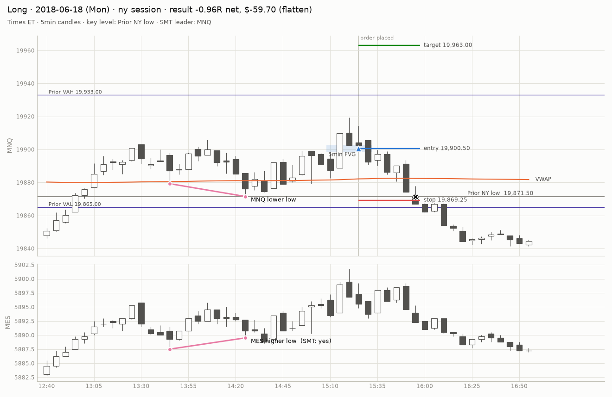
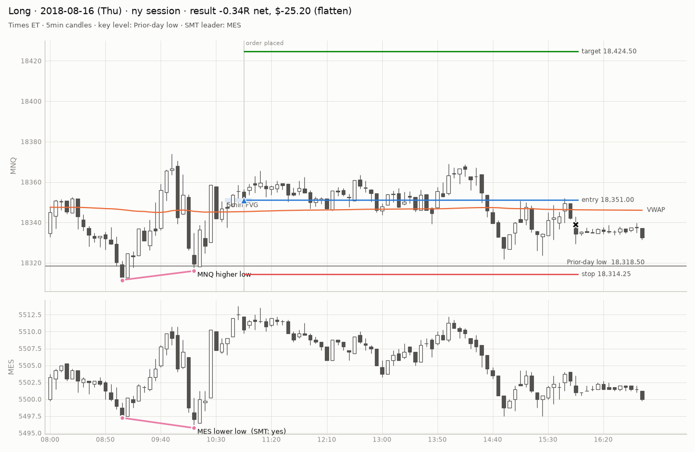
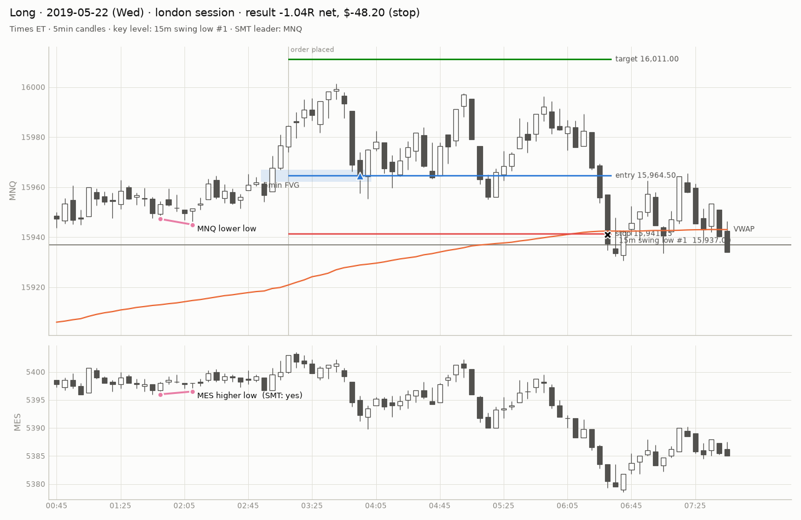
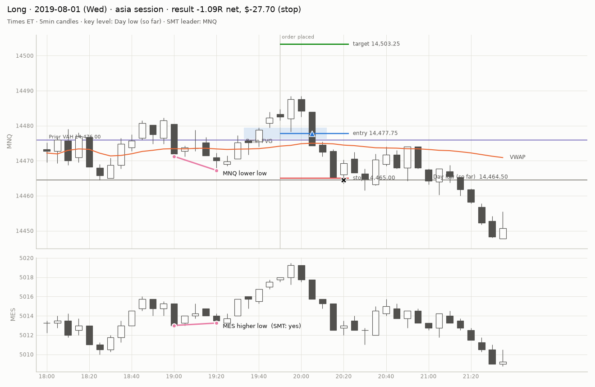
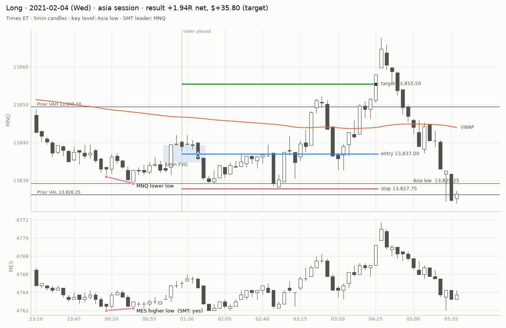
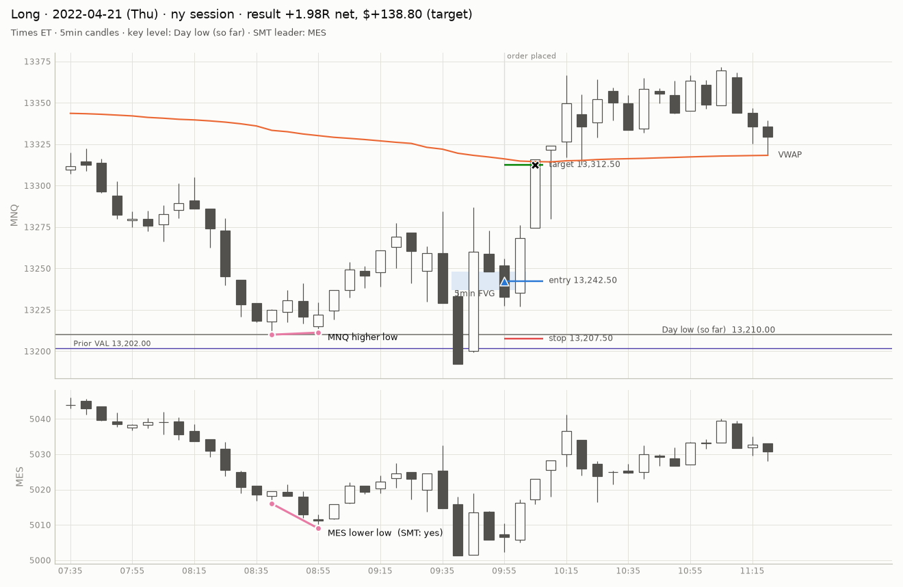

# Example signals — `baseline` (synthetic, dev)

> **SYNTHETIC DATA.** These numbers come from a random walk generated by `mnqbt synth`. They check that the pipeline runs and has no lookahead (a random walk must not show an edge). They say NOTHING about the real setup.

Randomly sampled trades (winners, losers and time exits). Check each against how you would mark it by hand.

## Example 1

- placed 2018-06-18 15:25 ET, filled 15:25, exit 15:55 (flatten)
- entry 19900.50, stop 19869.25, target 19963.00, risk 31.25 pts, result -0.96R net ($-59.70)
- key level `ny_l`, SMT leader MNQ, vol regime normal, VWAP side above, value area inside, structure against

## Example 2

- placed 2018-08-16 10:55 ET, filled 10:55, exit 15:55 (flatten)
- entry 18351.00, stop 18314.25, target 18424.50, risk 36.75 pts, result -0.34R net ($-25.20)
- key level `pdl`, SMT leader MES, vol regime normal, VWAP side above, value area below_val, structure against

## Example 3

- placed 2019-05-22 03:10 ET, filled 03:57, exit 06:33 (stop)
- entry 15964.50, stop 15941.25, target 16011.00, risk 23.25 pts, result -1.04R net ($-48.20)
- key level `sl1`, SMT leader MNQ, vol regime calm, VWAP side above, value area above_vah, structure with

## Example 4

- placed 2019-07-31 19:50 ET, filled 20:07, exit 20:21 (stop)
- entry 14477.75, stop 14465.00, target 14503.25, risk 12.75 pts, result -1.09R net ($-27.70)
- key level `dl`, SMT leader MNQ, vol regime normal, VWAP side above, value area above_vah, structure with

## Example 5

- placed 2021-02-04 01:25 ET, filled 01:43, exit 04:28 (target)
- entry 13837.00, stop 13827.75, target 13855.50, risk 9.25 pts, result +1.94R net ($+35.80)
- key level `asia_l`, SMT leader MNQ, vol regime calm, VWAP side below, value area inside, structure with

## Example 6

- placed 2022-04-21 09:55 ET, filled 09:55, exit 10:09 (target)
- entry 13242.50, stop 13207.50, target 13312.50, risk 35.00 pts, result +1.98R net ($+138.80)
- key level `dl`, SMT leader MES, vol regime volatile, VWAP side below, value area inside, structure against
