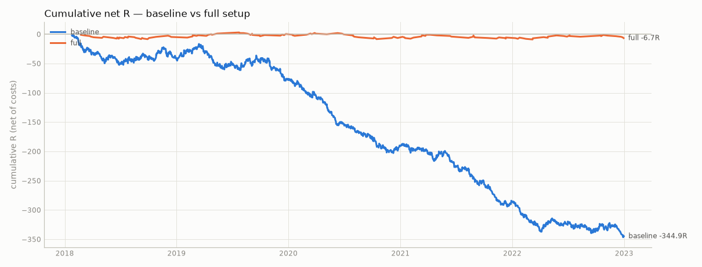
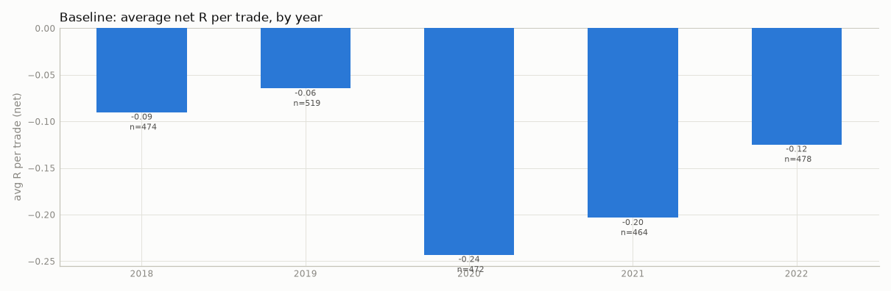

# Step 3 — does each piece help? (synthetic, dev: 2018-01-02 → 2022-12-31)

> **SYNTHETIC DATA.** These numbers come from a random walk generated by `mnqbt synth`. They check that the pipeline runs and has no lookahead (a random walk must not show an edge). They say NOTHING about the real setup.

15 strategy configurations were run (plus 2 engine-sensitivity runs). No parameter was tuned: every variant uses config/default.yaml and changes only the piece named.

- **avg R net**: average result per trade in units of initial risk, after commission, fees and slippage.
- **95% CI**: bootstrap confidence interval of avg R, resampling trades, and resampling whole trading days (safer when trades cluster).
- **PF**: gross profit ÷ gross loss in dollars, after costs. **max DD**: largest peak-to-trough fall of closed-trade equity.
- Rows marked ⚠ have fewer than 100 trades: treat them as anecdotes.

| variant | trades | /yr | win % | avg R net | 95% CI (trades) | 95% CI (day blocks) | PF | net $ | max DD $ | max DD R | longest losing streak | same-bar ambiguous | note |
|---|---|---|---|---|---|---|---|---|---|---|---|---|---|
| baseline | 2407 | 488 | 31.4 | -0.143 | [-0.197, -0.089] | [-0.199, -0.089] | 0.81 | -13,524 | 14,253 | 346.3 | 22 | 0.0% |  |
| +mood | 526 | 108 | 33.8 | -0.068 | [-0.184, +0.051] | [-0.188, +0.056] | 0.90 | -1,761 | 3,394 | 55.0 | 11 | 0.0% |  |
| +structure | 1102 | 224 | 30.0 | -0.181 | [-0.260, -0.100] | [-0.260, -0.101] | 0.75 | -8,218 | 8,280 | 202.6 | 12 | 0.0% |  |
| +vwap | 1054 | 214 | 31.6 | -0.135 | [-0.218, -0.051] | [-0.216, -0.054] | 0.82 | -5,846 | 6,128 | 158.5 | 13 | 0.0% |  |
| +value_area | 2447 | 496 | 31.2 | -0.149 | [-0.204, -0.094] | [-0.203, -0.094] | 0.81 | -13,982 | 14,548 | 365.7 | 22 | 0.0% |  |
| +fvg_15m | 949 | 192 | 33.8 | -0.065 | [-0.153, +0.023] | [-0.155, +0.025] | 0.94 | -2,055 | 4,597 | 90.6 | 19 | 0.0% |  |
| +liquidity_target | 2318 | 470 | 30.2 | -0.168 | [-0.229, -0.105] | [-0.232, -0.102] | 0.78 | -15,474 | 16,378 | 391.9 | 15 | 0.0% |  |
| full | 133 | 27 | 33.8 | -0.050 | [-0.286, +0.188] | [-0.292, +0.180] | 0.96 | -180 | 945 | 11.9 | 9 | 0.0% |  |
| full −key_level | 487 | 100 | 35.5 | -0.009 | [-0.133, +0.115] | [-0.133, +0.119] | 1.04 | 671 | 1,617 | 34.0 | 13 | 0.0% |  |
| full −smt | 494 | 102 | 33.4 | -0.064 | [-0.186, +0.060] | [-0.185, +0.061] | 0.92 | -1,490 | 3,456 | 61.5 | 17 | 0.0% |  |
| full −fvg | 244 | 50 | 35.7 | -0.032 | [-0.210, +0.146] | [-0.206, +0.140] | 1.07 | 538 | 1,347 | 32.7 | 9 | 0.0% |  |
| full −mood | 622 | 126 | 28.6 | -0.225 | [-0.329, -0.118] | [-0.326, -0.126] | 0.72 | -5,929 | 5,991 | 142.3 | 17 | 0.0% |  |
| full −structure | 269 | 55 | 32.7 | -0.095 | [-0.254, +0.078] | [-0.264, +0.076] | 0.88 | -1,194 | 2,060 | 25.9 | 8 | 0.0% |  |
| full −vwap | 226 | 47 | 34.1 | -0.052 | [-0.237, +0.132] | [-0.238, +0.132] | 0.89 | -882 | 1,534 | 18.4 | 8 | 0.0% |  |
| full −value_area | 127 | 26 | 34.6 | -0.028 | [-0.271, +0.228] | [-0.259, +0.208] | 1.07 | 318 | 802 | 10.9 | 7 | 0.0% |  |
| baseline, touch fills | 2438 | 494 | 32.1 | -0.124 | [-0.178, -0.069] | [-0.178, -0.069] | 0.84 | -11,903 | 12,749 | 303.5 | 22 | 0.0% |  |
| baseline, target first | 2407 | 488 | 31.4 | -0.143 | [-0.197, -0.089] | [-0.199, -0.089] | 0.81 | -13,524 | 14,253 | 346.3 | 22 | 0.0% |  |

### Comparison to reference (difference in avg R net, ± ~2 standard errors)

Overlapping trade sets make this rough; 'better/worse' needs the gap to exceed about two standard errors.

- **+mood**: +0.075R vs baseline (±0.134) → no clear difference
- **+structure**: -0.038R vs baseline (±0.100) → no clear difference
- **+vwap**: +0.009R vs baseline (±0.102) → no clear difference
- **+value_area**: -0.006R vs baseline (±0.079) → no clear difference
- **+fvg_15m**: +0.078R vs baseline (±0.106) → no clear difference
- **+liquidity_target**: -0.024R vs baseline (±0.086) → no clear difference
- **full**: +0.093R vs baseline (±0.250) → no clear difference
- **full −key_level**: +0.041R vs full (±0.275) → no clear difference
- **full −smt**: -0.013R vs full (±0.274) → no clear difference
- **full −fvg**: +0.018R vs full (±0.303) → no clear difference
- **full −mood**: -0.174R vs full (±0.266) → no clear difference
- **full −structure**: -0.045R vs full (±0.296) → no clear difference
- **full −vwap**: -0.001R vs full (±0.307) → no clear difference
- **full −value_area**: +0.023R vs full (±0.349) → no clear difference
- **baseline, touch fills**: +0.019R vs baseline (±0.079) → no clear difference
- **baseline, target first**: +0.000R vs baseline (±0.079) → no clear difference

## baseline

Signal funnel (how many candidates each rule removed)

| step | count |
|---|---:|
| triggers (all MNQ swings) | 118,373 |
| at a key level | 62,808 |
| with SMT | 12,298 |
| with an FVG entry | 7,788 |
| risk within limits | 6,925 |
| placed inside trading hours | 6,903 |
| tradeable day (not short/gap/spike) | 6,730 |
| allowed session | 6,552 |
| outside no-entry windows | 6,397 |
| before flatten time | 6,397 |
| ATR available | 6,397 |
| in period | 4,922 |
| order: filled | 2,407 |
| order: skipped_busy | 1,078 |
| order: cancel_target_first | 967 |
| order: expired_timeout | 470 |

**By session**

| session | trades | win_rate | avg_r_net | net_pnl_usd | profit_factor |
|---|---|---|---|---|---|
| asia | 983 | 31.5% | -0.126 | -3,644 | 0.84 |
| london | 809 | 30.2% | -0.151 | -3,313 | 0.87 |
| ny | 615 | 32.8% | -0.162 | -6,567 | 0.73 |

**By weekday**

| weekday | trades | win_rate | avg_r_net | net_pnl_usd | profit_factor |
|---|---|---|---|---|---|
| Monday | 453 | 31.1% | -0.157 | -2,723 | 0.79 |
| Tuesday | 476 | 29.0% | -0.218 | -3,384 | 0.78 |
| Wednesday | 504 | 33.5% | -0.077 | -2,368 | 0.84 |
| Thursday | 486 | 34.2% | -0.066 | -211 | 0.98 |
| Friday | 488 | 29.1% | -0.203 | -4,839 | 0.68 |

**By year**

| year | trades | win_rate | avg_r_net | net_pnl_usd | profit_factor |
|---|---|---|---|---|---|
| 2018 | 474 | 33.3% | -0.090 | -1,259 | 0.89 |
| 2019 | 519 | 33.9% | -0.065 | -958 | 0.93 |
| 2020 | 472 | 28.2% | -0.243 | -3,614 | 0.77 |
| 2021 | 464 | 29.5% | -0.203 | -5,015 | 0.70 |
| 2022 | 478 | 31.8% | -0.125 | -2,677 | 0.82 |

**By direction**

| direction | trades | win_rate | avg_r_net | net_pnl_usd | profit_factor |
|---|---|---|---|---|---|
| long | 1,267 | 32.1% | -0.131 | -5,907 | 0.84 |
| short | 1,140 | 30.6% | -0.157 | -7,617 | 0.78 |

**By vol regime**

| vol regime | trades | win_rate | avg_r_net | net_pnl_usd | profit_factor |
|---|---|---|---|---|---|
|  | 7 | 28.6% | -0.201 | -62 | 0.68 |
| calm | 745 | 29.9% | -0.203 | -5,154 | 0.72 |
| normal | 1,094 | 32.4% | -0.108 | -5,529 | 0.83 |
| volatile | 561 | 31.6% | -0.131 | -2,779 | 0.87 |

**By key level**

| key level | trades | win_rate | avg_r_net | net_pnl_usd | profit_factor |
|---|---|---|---|---|---|
| asia_h | 55 | 32.7% | -0.097 | -552 | 0.71 |
| asia_l | 67 | 31.3% | -0.153 | -1,651 | 0.44 |
| dh | 498 | 32.3% | -0.112 | -1,174 | 0.91 |
| dl | 579 | 32.8% | -0.102 | -735 | 0.95 |
| london_h | 44 | 29.5% | -0.199 | -350 | 0.70 |
| london_l | 53 | 30.2% | -0.233 | -514 | 0.73 |
| ny_h | 21 | 23.8% | -0.347 | -276 | 0.62 |
| ny_l | 33 | 48.5% | +0.327 | 637 | 2.17 |
| pdh | 33 | 21.2% | -0.420 | -475 | 0.60 |
| pdl | 45 | 37.8% | +0.043 | 208 | 1.19 |
| sh1 | 262 | 27.9% | -0.240 | -3,431 | 0.63 |
| sh2 | 133 | 31.6% | -0.112 | -1,025 | 0.74 |
| sh3 | 94 | 31.9% | -0.115 | -334 | 0.89 |
| sl1 | 264 | 27.3% | -0.283 | -2,719 | 0.69 |
| sl2 | 134 | 37.3% | +0.018 | -4 | 1.00 |
| sl3 | 92 | 27.2% | -0.267 | -1,130 | 0.66 |

**By SMT leader**

| SMT leader | trades | win_rate | avg_r_net | net_pnl_usd | profit_factor |
|---|---|---|---|---|---|
| MES | 989 | 31.9% | -0.131 | -4,287 | 0.86 |
| MNQ | 1,418 | 31.1% | -0.152 | -9,237 | 0.78 |

**By VWAP side**

| VWAP side | trades | win_rate | avg_r_net | net_pnl_usd | profit_factor |
|---|---|---|---|---|---|
| above | 1,149 | 32.1% | -0.122 | -5,410 | 0.84 |
| below | 1,258 | 30.8% | -0.162 | -8,114 | 0.79 |

**By value area**

| value area | trades | win_rate | avg_r_net | net_pnl_usd | profit_factor |
|---|---|---|---|---|---|
| above_vah | 694 | 32.1% | -0.120 | -3,592 | 0.83 |
| below_val | 772 | 32.5% | -0.113 | -2,214 | 0.90 |
| inside | 941 | 30.0% | -0.185 | -7,718 | 0.72 |

**By structure**

| structure | trades | win_rate | avg_r_net | net_pnl_usd | profit_factor |
|---|---|---|---|---|---|
| against | 1,418 | 32.5% | -0.112 | -5,737 | 0.86 |
| with | 989 | 29.8% | -0.188 | -7,787 | 0.74 |

**By news day**

| news day | trades | win_rate | avg_r_net | net_pnl_usd | profit_factor |
|---|---|---|---|---|---|
| False | 2,210 | 31.5% | -0.141 | -11,771 | 0.82 |
| True | 197 | 30.5% | -0.168 | -1,753 | 0.71 |

**By target**

| target | trades | win_rate | avg_r_net | net_pnl_usd | profit_factor |
|---|---|---|---|---|---|
| r_multiple | 2,407 | 31.4% | -0.143 | -13,524 | 0.81 |

## +mood

Overrides: `{"setup.filters.mood": true}`

Signal funnel (how many candidates each rule removed)

| step | count |
|---|---:|
| triggers (all MNQ swings) | 118,373 |
| at a key level | 62,808 |
| with SMT | 12,298 |
| with an FVG entry | 7,788 |
| risk within limits | 6,925 |
| placed inside trading hours | 6,903 |
| tradeable day (not short/gap/spike) | 6,730 |
| allowed session | 6,552 |
| outside no-entry windows | 6,397 |
| before flatten time | 6,397 |
| ATR available | 6,397 |
| filter: mood | 1,168 |
| in period | 911 |
| order: filled | 526 |
| order: cancel_target_first | 209 |
| order: expired_timeout | 90 |
| order: skipped_busy | 86 |

**By session**

| session | trades | win_rate | avg_r_net | net_pnl_usd | profit_factor |
|---|---|---|---|---|---|
| asia | 238 | 36.1% | +0.019 | 168 | 1.03 |
| london | 157 | 27.4% | -0.226 | -1,268 | 0.77 |
| ny | 131 | 37.4% | -0.038 | -661 | 0.88 |

**By weekday**

| weekday | trades | win_rate | avg_r_net | net_pnl_usd | profit_factor |
|---|---|---|---|---|---|
| Monday | 98 | 30.6% | -0.179 | -843 | 0.73 |
| Tuesday | 114 | 28.9% | -0.223 | -543 | 0.86 |
| Wednesday | 108 | 46.3% | +0.309 | 1,443 | 1.53 |
| Thursday | 104 | 32.7% | -0.082 | -90 | 0.97 |
| Friday | 102 | 30.4% | -0.173 | -1,728 | 0.57 |

**By year**

| year | trades | win_rate | avg_r_net | net_pnl_usd | profit_factor |
|---|---|---|---|---|---|
| 2018 | 103 | 35.9% | -0.010 | -116 | 0.95 |
| 2019 | 116 | 31.0% | -0.157 | -161 | 0.95 |
| 2020 | 97 | 29.9% | -0.139 | -706 | 0.83 |
| 2021 | 107 | 34.6% | -0.071 | -1,225 | 0.71 |
| 2022 | 103 | 37.9% | +0.043 | 447 | 1.14 |

## +structure

Overrides: `{"setup.filters.structure": true}`

Signal funnel (how many candidates each rule removed)

| step | count |
|---|---:|
| triggers (all MNQ swings) | 118,373 |
| at a key level | 62,808 |
| with SMT | 12,298 |
| with an FVG entry | 7,788 |
| risk within limits | 6,925 |
| placed inside trading hours | 6,903 |
| tradeable day (not short/gap/spike) | 6,730 |
| allowed session | 6,552 |
| outside no-entry windows | 6,397 |
| before flatten time | 6,397 |
| ATR available | 6,397 |
| filter: structure | 2,673 |
| in period | 2,028 |
| order: filled | 1,102 |
| order: cancel_target_first | 400 |
| order: skipped_busy | 296 |
| order: expired_timeout | 228 |
| order: expired_structure_flip | 2 |

**By session**

| session | trades | win_rate | avg_r_net | net_pnl_usd | profit_factor |
|---|---|---|---|---|---|
| asia | 508 | 30.1% | -0.170 | -2,822 | 0.76 |
| london | 359 | 26.5% | -0.265 | -3,741 | 0.68 |
| ny | 235 | 35.3% | -0.076 | -1,656 | 0.81 |

**By weekday**

| weekday | trades | win_rate | avg_r_net | net_pnl_usd | profit_factor |
|---|---|---|---|---|---|
| Monday | 204 | 32.8% | -0.098 | -1,212 | 0.80 |
| Tuesday | 218 | 24.8% | -0.334 | -2,826 | 0.61 |
| Wednesday | 238 | 31.5% | -0.136 | -1,320 | 0.80 |
| Thursday | 226 | 30.1% | -0.189 | -1,386 | 0.79 |
| Friday | 216 | 31.0% | -0.147 | -1,474 | 0.75 |

**By year**

| year | trades | win_rate | avg_r_net | net_pnl_usd | profit_factor |
|---|---|---|---|---|---|
| 2018 | 227 | 30.4% | -0.173 | -1,401 | 0.74 |
| 2019 | 253 | 33.2% | -0.079 | -268 | 0.96 |
| 2020 | 216 | 30.6% | -0.183 | -1,233 | 0.82 |
| 2021 | 188 | 27.1% | -0.273 | -2,486 | 0.63 |
| 2022 | 218 | 28.0% | -0.228 | -2,830 | 0.61 |

## +vwap

Overrides: `{"setup.filters.vwap": true}`

Signal funnel (how many candidates each rule removed)

| step | count |
|---|---:|
| triggers (all MNQ swings) | 118,373 |
| at a key level | 62,808 |
| with SMT | 12,298 |
| with an FVG entry | 7,788 |
| risk within limits | 6,925 |
| placed inside trading hours | 6,903 |
| tradeable day (not short/gap/spike) | 6,730 |
| allowed session | 6,552 |
| outside no-entry windows | 6,397 |
| before flatten time | 6,397 |
| ATR available | 6,397 |
| filter: vwap | 2,607 |
| in period | 1,985 |
| order: filled | 1,054 |
| order: cancel_target_first | 350 |
| order: skipped_busy | 314 |
| order: expired_timeout | 267 |

**By session**

| session | trades | win_rate | avg_r_net | net_pnl_usd | profit_factor |
|---|---|---|---|---|---|
| asia | 487 | 31.8% | -0.111 | -1,890 | 0.85 |
| london | 359 | 29.5% | -0.162 | -1,389 | 0.88 |
| ny | 208 | 34.6% | -0.143 | -2,567 | 0.71 |

**By weekday**

| weekday | trades | win_rate | avg_r_net | net_pnl_usd | profit_factor |
|---|---|---|---|---|---|
| Monday | 204 | 30.9% | -0.173 | -1,197 | 0.81 |
| Tuesday | 203 | 28.6% | -0.213 | -1,720 | 0.75 |
| Wednesday | 217 | 34.1% | -0.067 | -653 | 0.90 |
| Thursday | 220 | 34.1% | -0.070 | 160 | 1.03 |
| Friday | 210 | 30.0% | -0.160 | -2,437 | 0.66 |

**By year**

| year | trades | win_rate | avg_r_net | net_pnl_usd | profit_factor |
|---|---|---|---|---|---|
| 2018 | 209 | 36.8% | +0.024 | -353 | 0.93 |
| 2019 | 218 | 35.8% | -0.002 | 261 | 1.05 |
| 2020 | 218 | 29.4% | -0.215 | -177 | 0.98 |
| 2021 | 213 | 31.0% | -0.174 | -2,916 | 0.64 |
| 2022 | 196 | 24.5% | -0.319 | -2,661 | 0.62 |

## +value_area

Overrides: `{"setup.filters.value_area": true}`

Signal funnel (how many candidates each rule removed)

| step | count |
|---|---:|
| triggers (all MNQ swings) | 118,373 |
| at a key level | 64,466 |
| with SMT | 12,549 |
| with an FVG entry | 7,961 |
| risk within limits | 7,079 |
| placed inside trading hours | 7,057 |
| tradeable day (not short/gap/spike) | 6,878 |
| allowed session | 6,696 |
| outside no-entry windows | 6,537 |
| before flatten time | 6,537 |
| ATR available | 6,537 |
| in period | 5,022 |
| order: filled | 2,447 |
| order: skipped_busy | 1,112 |
| order: cancel_target_first | 989 |
| order: expired_timeout | 474 |

**By session**

| session | trades | win_rate | avg_r_net | net_pnl_usd | profit_factor |
|---|---|---|---|---|---|
| asia | 990 | 31.6% | -0.124 | -3,456 | 0.85 |
| london | 825 | 29.7% | -0.164 | -4,054 | 0.84 |
| ny | 632 | 32.6% | -0.168 | -6,472 | 0.75 |

**By weekday**

| weekday | trades | win_rate | avg_r_net | net_pnl_usd | profit_factor |
|---|---|---|---|---|---|
| Monday | 462 | 31.4% | -0.152 | -2,886 | 0.79 |
| Tuesday | 484 | 28.7% | -0.226 | -3,727 | 0.76 |
| Wednesday | 512 | 33.0% | -0.093 | -2,623 | 0.83 |
| Thursday | 494 | 33.8% | -0.076 | 68 | 1.00 |
| Friday | 495 | 29.1% | -0.202 | -4,814 | 0.69 |

**By year**

| year | trades | win_rate | avg_r_net | net_pnl_usd | profit_factor |
|---|---|---|---|---|---|
| 2018 | 480 | 32.9% | -0.102 | -1,618 | 0.86 |
| 2019 | 525 | 33.5% | -0.076 | -1,337 | 0.90 |
| 2020 | 480 | 28.3% | -0.237 | -3,100 | 0.80 |
| 2021 | 468 | 29.5% | -0.208 | -5,083 | 0.70 |
| 2022 | 494 | 31.6% | -0.130 | -2,844 | 0.82 |

## +fvg_15m

Overrides: `{"rules.fvg.timeframe": "15min"}`

Signal funnel (how many candidates each rule removed)

| step | count |
|---|---:|
| triggers (all MNQ swings) | 118,373 |
| at a key level | 62,808 |
| with SMT | 12,298 |
| with an FVG entry | 2,990 |
| risk within limits | 2,954 |
| placed inside trading hours | 2,929 |
| tradeable day (not short/gap/spike) | 2,849 |
| allowed session | 2,746 |
| outside no-entry windows | 2,688 |
| before flatten time | 2,688 |
| ATR available | 2,688 |
| in period | 2,073 |
| order: filled | 949 |
| order: expired_timeout | 459 |
| order: cancel_target_first | 418 |
| order: skipped_busy | 247 |

**By session**

| session | trades | win_rate | avg_r_net | net_pnl_usd | profit_factor |
|---|---|---|---|---|---|
| asia | 378 | 31.0% | -0.124 | -2,114 | 0.82 |
| london | 315 | 35.9% | +0.039 | 89 | 1.01 |
| ny | 256 | 35.5% | -0.107 | -31 | 1.00 |

**By weekday**

| weekday | trades | win_rate | avg_r_net | net_pnl_usd | profit_factor |
|---|---|---|---|---|---|
| Monday | 177 | 37.9% | +0.081 | 654 | 1.11 |
| Tuesday | 201 | 35.3% | -0.014 | 873 | 1.11 |
| Wednesday | 191 | 35.1% | -0.013 | -361 | 0.95 |
| Thursday | 196 | 31.6% | -0.155 | -1,028 | 0.87 |
| Friday | 184 | 29.3% | -0.221 | -2,193 | 0.68 |

**By year**

| year | trades | win_rate | avg_r_net | net_pnl_usd | profit_factor |
|---|---|---|---|---|---|
| 2018 | 168 | 36.3% | +0.027 | 1,061 | 1.22 |
| 2019 | 200 | 30.5% | -0.164 | -1,802 | 0.75 |
| 2020 | 195 | 29.7% | -0.185 | -2,116 | 0.76 |
| 2021 | 192 | 37.0% | +0.008 | 972 | 1.13 |
| 2022 | 194 | 36.1% | +0.005 | -170 | 0.98 |

## +liquidity_target

Overrides: `{"setup.target.mode": "liquidity"}`

Signal funnel (how many candidates each rule removed)

| step | count |
|---|---:|
| triggers (all MNQ swings) | 118,373 |
| at a key level | 62,808 |
| with SMT | 12,298 |
| with an FVG entry | 7,788 |
| risk within limits | 6,925 |
| placed inside trading hours | 6,903 |
| tradeable day (not short/gap/spike) | 6,730 |
| allowed session | 6,552 |
| outside no-entry windows | 6,397 |
| before flatten time | 6,397 |
| ATR available | 6,397 |
| in period | 4,922 |
| order: filled | 2,318 |
| order: cancel_target_first | 1,090 |
| order: skipped_busy | 1,044 |
| order: expired_timeout | 470 |

**By session**

| session | trades | win_rate | avg_r_net | net_pnl_usd | profit_factor |
|---|---|---|---|---|---|
| asia | 957 | 30.6% | -0.147 | -4,204 | 0.81 |
| london | 758 | 30.5% | -0.146 | -3,642 | 0.84 |
| ny | 603 | 29.4% | -0.228 | -7,628 | 0.69 |

**By weekday**

| weekday | trades | win_rate | avg_r_net | net_pnl_usd | profit_factor |
|---|---|---|---|---|---|
| Monday | 443 | 32.5% | -0.067 | -1,134 | 0.91 |
| Tuesday | 473 | 26.4% | -0.331 | -5,324 | 0.65 |
| Wednesday | 471 | 32.5% | -0.103 | -2,810 | 0.80 |
| Thursday | 464 | 32.1% | -0.131 | -1,496 | 0.89 |
| Friday | 467 | 27.8% | -0.200 | -4,710 | 0.67 |

**By year**

| year | trades | win_rate | avg_r_net | net_pnl_usd | profit_factor |
|---|---|---|---|---|---|
| 2018 | 450 | 30.9% | -0.131 | -1,900 | 0.82 |
| 2019 | 500 | 32.6% | -0.161 | -3,020 | 0.77 |
| 2020 | 451 | 27.7% | -0.285 | -4,369 | 0.70 |
| 2021 | 457 | 29.5% | -0.104 | -3,996 | 0.76 |
| 2022 | 460 | 30.2% | -0.159 | -2,190 | 0.85 |

## full

Overrides: `{"setup.filters.mood": true, "setup.filters.structure": true, "setup.filters.vwap": true, "setup.filters.value_area": true}`

Signal funnel (how many candidates each rule removed)

| step | count |
|---|---:|
| triggers (all MNQ swings) | 118,373 |
| at a key level | 64,466 |
| with SMT | 12,549 |
| with an FVG entry | 7,961 |
| risk within limits | 7,079 |
| placed inside trading hours | 7,057 |
| tradeable day (not short/gap/spike) | 6,878 |
| allowed session | 6,696 |
| outside no-entry windows | 6,537 |
| before flatten time | 6,537 |
| ATR available | 6,537 |
| filter: mood | 1,218 |
| filter: structure | 468 |
| filter: vwap | 289 |
| in period | 221 |
| order: filled | 133 |
| order: cancel_target_first | 38 |
| order: expired_timeout | 32 |
| order: skipped_busy | 18 |

**By session**

| session | trades | win_rate | avg_r_net | net_pnl_usd | profit_factor |
|---|---|---|---|---|---|
| asia | 63 | 36.5% | +0.047 | 208 | 1.10 |
| london | 42 | 28.6% | -0.185 | -105 | 0.93 |
| ny | 28 | 35.7% | -0.068 | -283 | 0.81 |

**By weekday**

| weekday | trades | win_rate | avg_r_net | net_pnl_usd | profit_factor |
|---|---|---|---|---|---|
| Monday | 26 | 34.6% | -0.002 | -52 | 0.95 |
| Tuesday | 34 | 23.5% | -0.394 | 47 | 1.03 |
| Wednesday | 20 | 50.0% | +0.398 | 153 | 1.32 |
| Thursday | 27 | 33.3% | -0.045 | 140 | 1.15 |
| Friday | 26 | 34.6% | -0.001 | -468 | 0.64 |

**By year**

| year | trades | win_rate | avg_r_net | net_pnl_usd | profit_factor |
|---|---|---|---|---|---|
| 2018 | 30 | 30.0% | -0.157 | -107 | 0.88 |
| 2019 | 26 | 42.3% | +0.194 | 442 | 1.61 |
| 2020 | 27 | 25.9% | -0.253 | -48 | 0.97 |
| 2021 | 26 | 38.5% | +0.032 | -323 | 0.68 |
| 2022 | 24 | 33.3% | -0.043 | -144 | 0.86 |

**By direction**

| direction | trades | win_rate | avg_r_net | net_pnl_usd | profit_factor |
|---|---|---|---|---|---|
| long | 60 | 28.3% | -0.209 | -884 | 0.66 |
| short | 73 | 38.4% | +0.080 | 704 | 1.28 |

**By vol regime**

| vol regime | trades | win_rate | avg_r_net | net_pnl_usd | profit_factor |
|---|---|---|---|---|---|
| normal | 98 | 34.7% | -0.033 | -668 | 0.82 |
| volatile | 35 | 31.4% | -0.099 | 489 | 1.34 |

**By key level**

| key level | trades | win_rate | avg_r_net | net_pnl_usd | profit_factor |
|---|---|---|---|---|---|
| asia_h | 2 | 50.0% | +0.464 | 19 | 1.39 |
| asia_l | 6 | 16.7% | -0.537 | -314 | 0.10 |
| dh | 13 | 30.8% | -0.126 | 292 | 1.90 |
| dl | 13 | 23.1% | -0.369 | -86 | 0.77 |
| london_h | 5 | 40.0% | +0.151 | 52 | 1.52 |
| ny_h | 4 | 25.0% | -0.294 | -175 | 0.21 |
| ny_l | 1 | 0.0% | -1.030 | -59 | 0.00 |
| sh1 | 21 | 38.1% | +0.011 | -47 | 0.94 |
| sh2 | 14 | 35.7% | +0.015 | 118 | 1.26 |
| sh3 | 10 | 50.0% | +0.464 | 431 | 2.03 |
| sl1 | 14 | 35.7% | -0.036 | 38 | 1.07 |
| sl2 | 11 | 45.5% | +0.406 | 72 | 1.29 |
| sl3 | 12 | 25.0% | -0.364 | -228 | 0.67 |
| vah | 4 | 50.0% | +0.467 | 14 | 1.06 |
| val | 3 | 0.0% | -1.027 | -307 | 0.00 |

**By SMT leader**

| SMT leader | trades | win_rate | avg_r_net | net_pnl_usd | profit_factor |
|---|---|---|---|---|---|
| MES | 78 | 41.0% | +0.138 | 801 | 1.31 |
| MNQ | 55 | 23.6% | -0.318 | -980 | 0.61 |

**By VWAP side**

| VWAP side | trades | win_rate | avg_r_net | net_pnl_usd | profit_factor |
|---|---|---|---|---|---|
| above | 60 | 28.3% | -0.209 | -884 | 0.66 |
| below | 73 | 38.4% | +0.080 | 704 | 1.28 |

**By value area**

| value area | trades | win_rate | avg_r_net | net_pnl_usd | profit_factor |
|---|---|---|---|---|---|
| above_vah | 40 | 20.0% | -0.468 | -244 | 0.85 |
| below_val | 44 | 36.4% | +0.005 | 215 | 1.13 |
| inside | 49 | 42.9% | +0.240 | -151 | 0.92 |

**By structure**

| structure | trades | win_rate | avg_r_net | net_pnl_usd | profit_factor |
|---|---|---|---|---|---|
| with | 133 | 33.8% | -0.050 | -180 | 0.96 |

**By news day**

| news day | trades | win_rate | avg_r_net | net_pnl_usd | profit_factor |
|---|---|---|---|---|---|
| False | 129 | 34.1% | -0.043 | -62 | 0.99 |
| True | 4 | 25.0% | -0.292 | -117 | 0.37 |

**By target**

| target | trades | win_rate | avg_r_net | net_pnl_usd | profit_factor |
|---|---|---|---|---|---|
| r_multiple | 133 | 33.8% | -0.050 | -180 | 0.96 |

## full −key_level

Overrides: `{"setup.filters.mood": true, "setup.filters.structure": true, "setup.filters.vwap": true, "setup.filters.value_area": true, "setup.require.key_level": false}`

Signal funnel (how many candidates each rule removed)

| step | count |
|---|---:|
| triggers (all MNQ swings) | 118,373 |
| with SMT | 20,550 |
| with an FVG entry | 13,309 |
| risk within limits | 11,877 |
| placed inside trading hours | 11,834 |
| tradeable day (not short/gap/spike) | 11,552 |
| allowed session | 11,163 |
| outside no-entry windows | 10,836 |
| before flatten time | 10,836 |
| ATR available | 10,836 |
| filter: mood | 2,731 |
| filter: structure | 1,427 |
| filter: vwap | 1,177 |
| in period | 901 |
| order: filled | 487 |
| order: cancel_target_first | 191 |
| order: skipped_busy | 123 |
| order: expired_timeout | 100 |

**By session**

| session | trades | win_rate | avg_r_net | net_pnl_usd | profit_factor |
|---|---|---|---|---|---|
| asia | 163 | 39.3% | +0.128 | 909 | 1.20 |
| london | 165 | 32.7% | -0.062 | 1,028 | 1.17 |
| ny | 159 | 34.6% | -0.095 | -1,266 | 0.82 |

**By weekday**

| weekday | trades | win_rate | avg_r_net | net_pnl_usd | profit_factor |
|---|---|---|---|---|---|
| Monday | 95 | 41.1% | +0.148 | 274 | 1.09 |
| Tuesday | 107 | 29.9% | -0.173 | -640 | 0.85 |
| Wednesday | 82 | 36.6% | +0.008 | 446 | 1.17 |
| Thursday | 99 | 34.3% | -0.054 | 246 | 1.07 |
| Friday | 104 | 36.5% | +0.045 | 346 | 1.08 |

**By year**

| year | trades | win_rate | avg_r_net | net_pnl_usd | profit_factor |
|---|---|---|---|---|---|
| 2018 | 100 | 28.0% | -0.228 | -904 | 0.72 |
| 2019 | 106 | 37.7% | +0.010 | 655 | 1.22 |
| 2020 | 94 | 33.0% | -0.080 | 481 | 1.12 |
| 2021 | 97 | 42.3% | +0.189 | 149 | 1.04 |
| 2022 | 90 | 36.7% | +0.070 | 289 | 1.08 |

## full −smt

Overrides: `{"setup.filters.mood": true, "setup.filters.structure": true, "setup.filters.vwap": true, "setup.filters.value_area": true, "setup.require.smt": false}`

Signal funnel (how many candidates each rule removed)

| step | count |
|---|---:|
| triggers (all MNQ swings) | 118,373 |
| at a key level | 64,466 |
| with an FVG entry | 40,809 |
| risk within limits | 36,267 |
| placed inside trading hours | 36,185 |
| tradeable day (not short/gap/spike) | 35,307 |
| allowed session | 34,311 |
| outside no-entry windows | 33,545 |
| before flatten time | 33,545 |
| ATR available | 33,545 |
| filter: mood | 7,159 |
| filter: structure | 2,544 |
| filter: vwap | 1,396 |
| in period | 1,063 |
| order: filled | 494 |
| order: skipped_busy | 280 |
| order: cancel_target_first | 164 |
| order: expired_timeout | 125 |

**By session**

| session | trades | win_rate | avg_r_net | net_pnl_usd | profit_factor |
|---|---|---|---|---|---|
| asia | 239 | 33.5% | -0.050 | -328 | 0.96 |
| london | 159 | 33.3% | -0.044 | -397 | 0.94 |
| ny | 96 | 33.3% | -0.131 | -766 | 0.83 |

**By weekday**

| weekday | trades | win_rate | avg_r_net | net_pnl_usd | profit_factor |
|---|---|---|---|---|---|
| Monday | 87 | 39.1% | +0.103 | 1,001 | 1.37 |
| Tuesday | 116 | 34.5% | -0.042 | -49 | 0.99 |
| Wednesday | 104 | 36.5% | -0.000 | 44 | 1.01 |
| Thursday | 94 | 25.5% | -0.277 | -1,044 | 0.72 |
| Friday | 93 | 31.2% | -0.101 | -1,442 | 0.65 |

**By year**

| year | trades | win_rate | avg_r_net | net_pnl_usd | profit_factor |
|---|---|---|---|---|---|
| 2018 | 97 | 39.2% | +0.081 | 786 | 1.32 |
| 2019 | 94 | 31.9% | -0.113 | -523 | 0.83 |
| 2020 | 106 | 31.1% | -0.117 | 333 | 1.08 |
| 2021 | 102 | 25.5% | -0.314 | -2,317 | 0.56 |
| 2022 | 95 | 40.0% | +0.167 | 231 | 1.06 |

## full −fvg

Overrides: `{"setup.filters.mood": true, "setup.filters.structure": true, "setup.filters.vwap": true, "setup.filters.value_area": true, "setup.require.fvg": false}`

Signal funnel (how many candidates each rule removed)

| step | count |
|---|---:|
| triggers (all MNQ swings) | 118,373 |
| at a key level | 64,466 |
| with SMT | 12,549 |
| market-entry candidates (no FVG) | 12,549 |
| risk within limits | 11,685 |
| placed inside trading hours | 11,657 |
| tradeable day (not short/gap/spike) | 11,341 |
| allowed session | 11,001 |
| outside no-entry windows | 10,797 |
| before flatten time | 10,797 |
| ATR available | 10,797 |
| filter: mood | 2,262 |
| filter: structure | 836 |
| filter: vwap | 325 |
| in period | 250 |
| order: filled | 244 |
| order: skipped_busy | 6 |

**By session**

| session | trades | win_rate | avg_r_net | net_pnl_usd | profit_factor |
|---|---|---|---|---|---|
| asia | 125 | 36.8% | +0.047 | 810 | 1.27 |
| london | 63 | 31.7% | -0.100 | -46 | 0.98 |
| ny | 56 | 37.5% | -0.132 | -227 | 0.87 |

**By weekday**

| weekday | trades | win_rate | avg_r_net | net_pnl_usd | profit_factor |
|---|---|---|---|---|---|
| Monday | 43 | 27.9% | -0.235 | -726 | 0.61 |
| Tuesday | 57 | 40.4% | +0.081 | 663 | 1.48 |
| Wednesday | 48 | 29.2% | -0.254 | -256 | 0.82 |
| Thursday | 51 | 37.3% | +0.008 | 486 | 1.31 |
| Friday | 45 | 42.2% | +0.209 | 372 | 1.29 |

**By year**

| year | trades | win_rate | avg_r_net | net_pnl_usd | profit_factor |
|---|---|---|---|---|---|
| 2018 | 58 | 39.7% | +0.085 | 245 | 1.18 |
| 2019 | 51 | 39.2% | +0.072 | 521 | 1.46 |
| 2020 | 45 | 24.4% | -0.346 | -742 | 0.59 |
| 2021 | 53 | 35.8% | -0.041 | 40 | 1.02 |
| 2022 | 37 | 37.8% | +0.034 | 474 | 1.36 |

## full −mood

Overrides: `{"setup.filters.mood": false, "setup.filters.structure": true, "setup.filters.vwap": true, "setup.filters.value_area": true}`

Signal funnel (how many candidates each rule removed)

| step | count |
|---|---:|
| triggers (all MNQ swings) | 118,373 |
| at a key level | 64,466 |
| with SMT | 12,549 |
| with an FVG entry | 7,961 |
| risk within limits | 7,079 |
| placed inside trading hours | 7,057 |
| tradeable day (not short/gap/spike) | 6,878 |
| allowed session | 6,696 |
| outside no-entry windows | 6,537 |
| before flatten time | 6,537 |
| ATR available | 6,537 |
| filter: structure | 2,736 |
| filter: vwap | 1,540 |
| in period | 1,159 |
| order: filled | 622 |
| order: cancel_target_first | 212 |
| order: expired_timeout | 169 |
| order: skipped_busy | 156 |

**By session**

| session | trades | win_rate | avg_r_net | net_pnl_usd | profit_factor |
|---|---|---|---|---|---|
| asia | 242 | 28.9% | -0.198 | -1,686 | 0.74 |
| london | 231 | 25.5% | -0.285 | -2,674 | 0.68 |
| ny | 149 | 32.9% | -0.176 | -1,569 | 0.74 |

**By weekday**

| weekday | trades | win_rate | avg_r_net | net_pnl_usd | profit_factor |
|---|---|---|---|---|---|
| Monday | 120 | 30.8% | -0.170 | -968 | 0.74 |
| Tuesday | 126 | 24.6% | -0.327 | -1,812 | 0.63 |
| Wednesday | 120 | 30.0% | -0.190 | -764 | 0.79 |
| Thursday | 138 | 29.0% | -0.238 | -900 | 0.79 |
| Friday | 118 | 28.8% | -0.192 | -1,487 | 0.66 |

**By year**

| year | trades | win_rate | avg_r_net | net_pnl_usd | profit_factor |
|---|---|---|---|---|---|
| 2018 | 118 | 31.4% | -0.131 | -1,060 | 0.68 |
| 2019 | 136 | 33.1% | -0.082 | -202 | 0.95 |
| 2020 | 129 | 28.7% | -0.255 | -462 | 0.90 |
| 2021 | 113 | 27.4% | -0.280 | -1,744 | 0.60 |
| 2022 | 126 | 22.2% | -0.387 | -2,462 | 0.50 |

## full −structure

Overrides: `{"setup.filters.mood": true, "setup.filters.structure": false, "setup.filters.vwap": true, "setup.filters.value_area": true}`

Signal funnel (how many candidates each rule removed)

| step | count |
|---|---:|
| triggers (all MNQ swings) | 118,373 |
| at a key level | 64,466 |
| with SMT | 12,549 |
| with an FVG entry | 7,961 |
| risk within limits | 7,079 |
| placed inside trading hours | 7,057 |
| tradeable day (not short/gap/spike) | 6,878 |
| allowed session | 6,696 |
| outside no-entry windows | 6,537 |
| before flatten time | 6,537 |
| ATR available | 6,537 |
| filter: mood | 1,218 |
| filter: vwap | 613 |
| in period | 465 |
| order: filled | 269 |
| order: cancel_target_first | 89 |
| order: expired_timeout | 63 |
| order: skipped_busy | 44 |

**By session**

| session | trades | win_rate | avg_r_net | net_pnl_usd | profit_factor |
|---|---|---|---|---|---|
| asia | 134 | 36.6% | +0.042 | 322 | 1.08 |
| london | 80 | 22.5% | -0.358 | -876 | 0.74 |
| ny | 55 | 38.2% | -0.047 | -640 | 0.79 |

**By weekday**

| weekday | trades | win_rate | avg_r_net | net_pnl_usd | profit_factor |
|---|---|---|---|---|---|
| Monday | 55 | 32.7% | -0.142 | -536 | 0.73 |
| Tuesday | 55 | 25.5% | -0.314 | -404 | 0.83 |
| Wednesday | 55 | 45.5% | +0.277 | 719 | 1.52 |
| Thursday | 55 | 29.1% | -0.177 | 93 | 1.05 |
| Friday | 49 | 30.6% | -0.122 | -1,066 | 0.58 |

**By year**

| year | trades | win_rate | avg_r_net | net_pnl_usd | profit_factor |
|---|---|---|---|---|---|
| 2018 | 56 | 30.4% | -0.173 | -528 | 0.70 |
| 2019 | 53 | 35.8% | +0.004 | 491 | 1.32 |
| 2020 | 57 | 28.1% | -0.178 | -230 | 0.91 |
| 2021 | 59 | 39.0% | +0.017 | -723 | 0.70 |
| 2022 | 44 | 29.5% | -0.158 | -204 | 0.89 |

## full −vwap

Overrides: `{"setup.filters.mood": true, "setup.filters.structure": true, "setup.filters.vwap": false, "setup.filters.value_area": true}`

Signal funnel (how many candidates each rule removed)

| step | count |
|---|---:|
| triggers (all MNQ swings) | 118,373 |
| at a key level | 64,466 |
| with SMT | 12,549 |
| with an FVG entry | 7,961 |
| risk within limits | 7,079 |
| placed inside trading hours | 7,057 |
| tradeable day (not short/gap/spike) | 6,878 |
| allowed session | 6,696 |
| outside no-entry windows | 6,537 |
| before flatten time | 6,537 |
| ATR available | 6,537 |
| filter: mood | 1,218 |
| filter: structure | 468 |
| in period | 363 |
| order: filled | 226 |
| order: cancel_target_first | 71 |
| order: expired_timeout | 40 |
| order: skipped_busy | 25 |
| order: expired_structure_flip | 1 |

**By session**

| session | trades | win_rate | avg_r_net | net_pnl_usd | profit_factor |
|---|---|---|---|---|---|
| asia | 114 | 36.8% | +0.044 | 307 | 1.10 |
| london | 65 | 29.2% | -0.172 | -578 | 0.76 |
| ny | 47 | 34.0% | -0.116 | -611 | 0.73 |

**By weekday**

| weekday | trades | win_rate | avg_r_net | net_pnl_usd | profit_factor |
|---|---|---|---|---|---|
| Monday | 37 | 32.4% | -0.073 | -200 | 0.86 |
| Tuesday | 53 | 26.4% | -0.290 | -114 | 0.94 |
| Wednesday | 44 | 40.9% | +0.137 | -51 | 0.96 |
| Thursday | 46 | 32.6% | -0.079 | -35 | 0.97 |
| Friday | 46 | 39.1% | +0.086 | -482 | 0.72 |

**By year**

| year | trades | win_rate | avg_r_net | net_pnl_usd | profit_factor |
|---|---|---|---|---|---|
| 2018 | 52 | 32.7% | -0.088 | -236 | 0.83 |
| 2019 | 47 | 34.0% | -0.056 | 179 | 1.13 |
| 2020 | 39 | 33.3% | -0.037 | -57 | 0.97 |
| 2021 | 43 | 32.6% | -0.120 | -628 | 0.62 |
| 2022 | 45 | 37.8% | +0.046 | -139 | 0.91 |

## full −value_area

Overrides: `{"setup.filters.mood": true, "setup.filters.structure": true, "setup.filters.vwap": true, "setup.filters.value_area": false}`

Signal funnel (how many candidates each rule removed)

| step | count |
|---|---:|
| triggers (all MNQ swings) | 118,373 |
| at a key level | 62,808 |
| with SMT | 12,298 |
| with an FVG entry | 7,788 |
| risk within limits | 6,925 |
| placed inside trading hours | 6,903 |
| tradeable day (not short/gap/spike) | 6,730 |
| allowed session | 6,552 |
| outside no-entry windows | 6,397 |
| before flatten time | 6,397 |
| ATR available | 6,397 |
| filter: mood | 1,168 |
| filter: structure | 450 |
| filter: vwap | 273 |
| in period | 213 |
| order: filled | 127 |
| order: cancel_target_first | 36 |
| order: expired_timeout | 32 |
| order: skipped_busy | 18 |

**By session**

| session | trades | win_rate | avg_r_net | net_pnl_usd | profit_factor |
|---|---|---|---|---|---|
| asia | 62 | 35.5% | +0.016 | 153 | 1.08 |
| london | 39 | 30.8% | -0.119 | 120 | 1.09 |
| ny | 26 | 38.5% | +0.005 | 45 | 1.04 |

**By weekday**

| weekday | trades | win_rate | avg_r_net | net_pnl_usd | profit_factor |
|---|---|---|---|---|---|
| Monday | 25 | 32.0% | -0.080 | -108 | 0.89 |
| Tuesday | 33 | 24.2% | -0.375 | 155 | 1.12 |
| Wednesday | 19 | 52.6% | +0.475 | 216 | 1.52 |
| Thursday | 25 | 36.0% | +0.035 | 302 | 1.40 |
| Friday | 25 | 36.0% | +0.040 | -248 | 0.77 |

**By year**

| year | trades | win_rate | avg_r_net | net_pnl_usd | profit_factor |
|---|---|---|---|---|---|
| 2018 | 28 | 32.1% | -0.095 | 140 | 1.21 |
| 2019 | 25 | 44.0% | +0.243 | 550 | 1.89 |
| 2020 | 25 | 28.0% | -0.191 | 150 | 1.12 |
| 2021 | 26 | 38.5% | +0.032 | -323 | 0.68 |
| 2022 | 23 | 30.4% | -0.130 | -200 | 0.81 |

## baseline, touch fills

Overrides: `{"backtest.fill_mode": "touch"}`

Signal funnel (how many candidates each rule removed)

| step | count |
|---|---:|
| triggers (all MNQ swings) | 118,373 |
| at a key level | 62,808 |
| with SMT | 12,298 |
| with an FVG entry | 7,788 |
| risk within limits | 6,925 |
| placed inside trading hours | 6,903 |
| tradeable day (not short/gap/spike) | 6,730 |
| allowed session | 6,552 |
| outside no-entry windows | 6,397 |
| before flatten time | 6,397 |
| ATR available | 6,397 |
| in period | 4,922 |
| order: filled | 2,438 |
| order: skipped_busy | 1,086 |
| order: cancel_target_first | 959 |
| order: expired_timeout | 439 |

**By session**

| session | trades | win_rate | avg_r_net | net_pnl_usd | profit_factor |
|---|---|---|---|---|---|
| asia | 1,002 | 32.2% | -0.105 | -2,958 | 0.87 |
| london | 817 | 30.8% | -0.130 | -3,046 | 0.88 |
| ny | 619 | 33.4% | -0.147 | -5,898 | 0.76 |

**By weekday**

| weekday | trades | win_rate | avg_r_net | net_pnl_usd | profit_factor |
|---|---|---|---|---|---|
| Monday | 457 | 31.7% | -0.138 | -2,388 | 0.82 |
| Tuesday | 484 | 30.4% | -0.176 | -2,667 | 0.82 |
| Wednesday | 507 | 33.7% | -0.071 | -2,265 | 0.85 |
| Thursday | 494 | 34.8% | -0.050 | -32 | 1.00 |
| Friday | 496 | 29.6% | -0.188 | -4,551 | 0.70 |

**By year**

| year | trades | win_rate | avg_r_net | net_pnl_usd | profit_factor |
|---|---|---|---|---|---|
| 2018 | 480 | 34.0% | -0.071 | -1,142 | 0.90 |
| 2019 | 524 | 34.0% | -0.063 | -974 | 0.93 |
| 2020 | 479 | 29.2% | -0.211 | -2,992 | 0.81 |
| 2021 | 472 | 30.7% | -0.170 | -4,344 | 0.74 |
| 2022 | 483 | 32.3% | -0.112 | -2,451 | 0.84 |

## baseline, target first

Overrides: `{"backtest.same_bar": "target_first"}`

Signal funnel (how many candidates each rule removed)

| step | count |
|---|---:|
| triggers (all MNQ swings) | 118,373 |
| at a key level | 62,808 |
| with SMT | 12,298 |
| with an FVG entry | 7,788 |
| risk within limits | 6,925 |
| placed inside trading hours | 6,903 |
| tradeable day (not short/gap/spike) | 6,730 |
| allowed session | 6,552 |
| outside no-entry windows | 6,397 |
| before flatten time | 6,397 |
| ATR available | 6,397 |
| in period | 4,922 |
| order: filled | 2,407 |
| order: skipped_busy | 1,078 |
| order: cancel_target_first | 967 |
| order: expired_timeout | 470 |

**By session**

| session | trades | win_rate | avg_r_net | net_pnl_usd | profit_factor |
|---|---|---|---|---|---|
| asia | 983 | 31.5% | -0.126 | -3,644 | 0.84 |
| london | 809 | 30.2% | -0.151 | -3,313 | 0.87 |
| ny | 615 | 32.8% | -0.162 | -6,567 | 0.73 |

**By weekday**

| weekday | trades | win_rate | avg_r_net | net_pnl_usd | profit_factor |
|---|---|---|---|---|---|
| Monday | 453 | 31.1% | -0.157 | -2,723 | 0.79 |
| Tuesday | 476 | 29.0% | -0.218 | -3,384 | 0.78 |
| Wednesday | 504 | 33.5% | -0.077 | -2,368 | 0.84 |
| Thursday | 486 | 34.2% | -0.066 | -211 | 0.98 |
| Friday | 488 | 29.1% | -0.203 | -4,839 | 0.68 |

**By year**

| year | trades | win_rate | avg_r_net | net_pnl_usd | profit_factor |
|---|---|---|---|---|---|
| 2018 | 474 | 33.3% | -0.090 | -1,259 | 0.89 |
| 2019 | 519 | 33.9% | -0.065 | -958 | 0.93 |
| 2020 | 472 | 28.2% | -0.243 | -3,614 | 0.77 |
| 2021 | 464 | 29.5% | -0.203 | -5,015 | 0.70 |
| 2022 | 478 | 31.8% | -0.125 | -2,677 | 0.82 |

