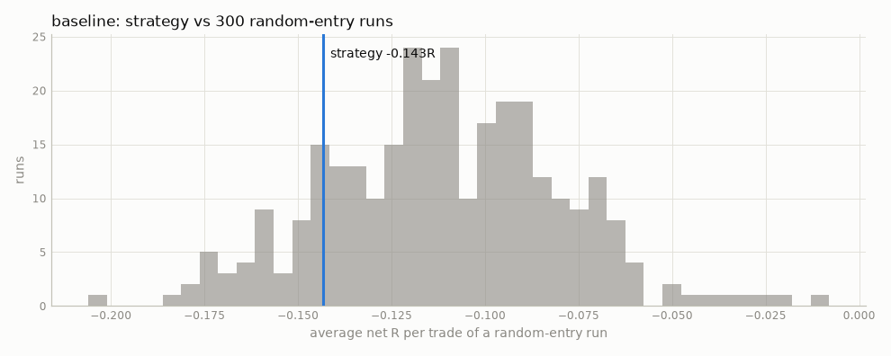
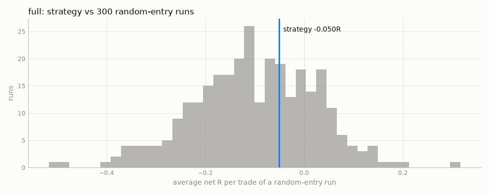

# Step 4 — tuning, walk-forward, stability, random benchmark (synthetic)

> **SYNTHETIC DATA.** These numbers come from a random walk generated by `mnqbt synth`. They check that the pipeline runs and has no lookahead (a random walk must not show an edge). They say NOTHING about the real setup.

Development period: 2018-01-02 → 2022-12-31. The holdout (2023-01-01 →) is NOT used here.

## Tuning grid: 12 combinations tried (baseline setup)

Pre-declared in config (`research.tuning_grid`); nothing else was tuned. Every combination is listed — the best of N noisy results is biased upward, so read the spread, not the maximum.

| fvg_fraction | r_multiple | max_minutes_smt_to_fvg | trades | win_rate | avg_r_net | ci_low | ci_high | profit_factor | net_pnl_usd | max_dd_r |
|---|---|---|---|---|---|---|---|---|---|---|
| 0.5 | 1.500 | 30 | 1,957 | 37.1% | -0.139 | -0.192 | -0.085 | 0.800 | -10,614 | 275.751 |
| 0.5 | 1.500 | 60 | 2,264 | 36.9% | -0.144 | -0.193 | -0.095 | 0.812 | -11,818 | 326.543 |
| 0.5 | 2.000 | 30 | 2,083 | 31.7% | -0.133 | -0.190 | -0.071 | 0.799 | -12,283 | 278.724 |
| 0.5 | 2.000 | 60 | 2,407 | 31.4% | -0.143 | -0.197 | -0.089 | 0.812 | -13,524 | 346.330 |
| 0.5 | 3.000 | 30 | 2,104 | 24.5% | -0.143 | -0.213 | -0.071 | 0.799 | -13,504 | 307.769 |
| 0.5 | 3.000 | 60 | 2,403 | 23.9% | -0.167 | -0.234 | -0.102 | 0.812 | -14,674 | 417.256 |
| 0.0 | 1.500 | 30 | 2,377 | 36.9% | -0.132 | -0.180 | -0.084 | 0.800 | -15,031 | 318.707 |
| 0.0 | 1.500 | 60 | 2,790 | 37.1% | -0.129 | -0.174 | -0.083 | 0.824 | -15,511 | 365.101 |
| 0.0 | 2.000 | 30 | 2,384 | 30.5% | -0.161 | -0.215 | -0.106 | 0.782 | -17,817 | 385.603 |
| 0.0 | 2.000 | 60 | 2,781 | 30.5% | -0.160 | -0.210 | -0.110 | 0.809 | -18,211 | 449.252 |
| 0.0 | 3.000 | 30 | 2,344 | 24.4% | -0.150 | -0.214 | -0.084 | 0.835 | -14,152 | 362.042 |
| 0.0 | 3.000 | 60 | 2,711 | 23.8% | -0.172 | -0.234 | -0.110 | 0.826 | -17,399 | 474.197 |

## Anchored walk-forward (inside the development period)

Each year is tested with the combination that looked best on all earlier years; the table shows whether that choice held up.

| test_year | chosen | train_avg_r | test_trades | test_avg_r | test_win_rate | default_params_test_avg_r |
|---|---|---|---|---|---|---|
| 2019 | fvg_fraction=0.0, r_multiple=3.0, max_minutes_smt_to_fvg=30 | -0.001 | 504 | -0.206 | 0.228 | -0.065 |
| 2020 | fvg_fraction=0.5, r_multiple=2.0, max_minutes_smt_to_fvg=30 | -0.053 | 395 | -0.247 | 0.284 | -0.243 |
| 2021 | fvg_fraction=0.5, r_multiple=2.0, max_minutes_smt_to_fvg=30 | -0.114 | 394 | -0.153 | 0.310 | -0.203 |
| 2022 | fvg_fraction=0.0, r_multiple=1.5, max_minutes_smt_to_fvg=30 | -0.122 | 486 | -0.172 | 0.354 | -0.125 |

Stitched walk-forward out-of-sample: **1779 trades, avg R net -0.194 [95% CI -0.257, -0.128]**, win rate 29.3%. 

## Stability of the (untuned) baseline

**By year**

| year | trades | win_rate | avg_r_net | net_pnl_usd | profit_factor |
|---|---|---|---|---|---|
| 2018 | 474 | 33.3% | -0.090 | -1,259 | 0.89 |
| 2019 | 519 | 33.9% | -0.065 | -958 | 0.93 |
| 2020 | 472 | 28.2% | -0.243 | -3,614 | 0.77 |
| 2021 | 464 | 29.5% | -0.203 | -5,015 | 0.70 |
| 2022 | 478 | 31.8% | -0.125 | -2,677 | 0.82 |

**By vol regime**

| vol regime | trades | win_rate | avg_r_net | net_pnl_usd | profit_factor |
|---|---|---|---|---|---|
|  | 7 | 28.6% | -0.201 | -62 | 0.68 |
| calm | 745 | 29.9% | -0.203 | -5,154 | 0.72 |
| normal | 1,094 | 32.4% | -0.108 | -5,529 | 0.83 |
| volatile | 561 | 31.6% | -0.131 | -2,779 | 0.87 |

**By session**

| session | trades | win_rate | avg_r_net | net_pnl_usd | profit_factor |
|---|---|---|---|---|---|
| asia | 983 | 31.5% | -0.126 | -3,644 | 0.84 |
| london | 809 | 30.2% | -0.151 | -3,313 | 0.87 |
| ny | 615 | 32.8% | -0.162 | -6,567 | 0.73 |

## Random-entry benchmark

Each real order is replayed on a random day at the same time of day: same order type, same limit distance from the market (in ATRs), same wait, stop (in ATRs), target (in R), fill rules, exits and costs — only the signal is missing. If the strategy's avg R is not clearly to the right of this distribution, the signals add nothing.

**baseline**: strategy -0.143R vs random mean -0.111R (5–95%: -0.162 … -0.064); one-sided p = 0.850

**full**: strategy -0.050R vs random mean -0.101R (5–95%: -0.312 … +0.085); one-sided p = 0.359

